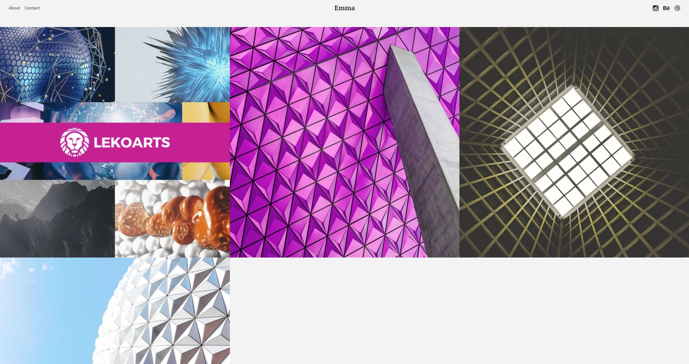

Gatsby erlaubt es per CLI sogenannte "Starter" zu installieren. Diese sind wie der Name suggeriert vorkonfigurierte Gatsby-Projekte, die einen schnellen Start für das eigene Projekt ermöglichen. Einige Starter bieten eine gute Grundlage für ein Design-Framework (z.B. Google Material Design), andere kommen ohne Styling aus und fokussieren sich auf Funktionen.

## Gatsby Starter Portfolio: Emma

Unter der Eigenschöpfung **Gatsby Starter Portfolio** habe ich mein erstes Theme namens *Emma* veröffentlicht. Meine Starter sind für Designer und Fotografen der optimale Einstieg in ihr Gatsby-Projekt - alle Projekte werden minimalistisch und einfach zu konfigurieren sein.

Eine Vorschau gibts [hier](https://portfolio-emma.netlify.com).

Das *Emma* Theme bietet ein Bild-Raster über die volle Fensterbreite, automatische Akzent-Farben für die Projekte und ein ansonsten helles Layout. Auch sind diverse Plugins zu SEO, Bildern und Typographie installiert.

Eine volle Übersicht aller Features und Hinweise zur Installation und Konfiguration gibt es im entsprechenden [Github Repository](https://github.com/LeKoArts/gatsby-starter-portfolio-emma).