Compositing wird gerne als die Königsdisziplin der digitalen Bildbearbeitung bezeichnet – in meinen Augen zurecht. Bis zum fertigen Bild ist es ein mehrstufiger Prozess: [Sichtung von Material](/blog/photoshop-compositing-basics-stockfotos), [Konzeption](/blog/photoshop-compositing-basics-konzeption) (Skizzen & Komposition und Arrangement der Bilder), Erstellung der Bildcollage und die [Fertigstellung](/blog/photoshop-compositing-basics-fertigstellung) als Gesamtkunstwerk. Ziel dieses Tutorials ist es den Punkt „Bildcollage“ genauer zu beleuchten, da sich viele damit am schwersten tun – in Folge dessen ist dies der erste Teil meiner kleinen Compositing Reihe. Die anderen Prozessschritte werden folgen.

Dieses und nachfolgende Tutorials der Reihe richten sich an fortgeschrittene Photoshop-Nutzer, d.h. die Basics wie Masken, Pfadwerkzeug, Filter, Transformationswerkzeuge etc. sollten sitzen. Deshalb werde ich im Laufe des Tutorials auch größere Sprünge machen bzw. nicht auf jedes Detail eingehen, um mich besser auf die Kernpunkte fokussieren zu können.

Solltest du diesem Tutorial ganz genau folgen wollen, biete ich dir die vollständigen Projektdateien zum Download an! Besuche hierzu meine [Patreon Seite](https://www.patreon.com/lekoarts) und erhalte deine Rewards für 10$. Vielen Dank an alle Unterstützer – ihr erlaubt es mir bessere Tutorials zu erstellen!
Alternativ kannst du dir [dieses Speedart](https://www.youtube.com/watch?v=l9ZwGca7SqQ) ansehen.

# Inhaltsverzeichnis

1. [Fundament](#fundament)
2. [Fleckchen Erde](#fleckchen-erde)
3. [Landschaft](#landschaft)
4. [Wanderer](#wanderer)
5. [Details](#details)
6. [Zusammenfassung](#zusammenfassung)

## Fundament

Das Dokument sollte den späteren Nutzungszwecken entsprechend erstellt werden (für den Druck mind. 300 dpi) und der weiße Hintergrund durch die gewünschte Farbe ersetzt werden – wenn man sich noch nicht sicher ist, kann es auch 50% Grau sein. Sinn des Ganzen ist es das spätere Malen von Licht & Schatten besser beurteilen zu können, da die weiße Farbe ansonsten Kontraste anders erscheinen lässt (**Quicktipp:** Färbe deinen Hintergrund in Photoshop auf 50% Grau!). Um dem Hintergrund schon ein wenig Tiefe zu verleihen, kannst du per Gradationskurven und Masken die Illusion eines Raumes/einer Papierwand erzeugen. Ziehe hierzu die Gradationskurve nach unten/oben und zeichne per Maske die Änderungen ein:

Eine gestreckte Ellipse verdunkelt die Mitte, ein Balken erhellt die Mitte, von oben herab verdunkelt wieder ein Verlauf und schlussendlich erhellt nochmal ein Punkt in der Mitte.

Das Ergebnis sieht dann wie folgt aus:

Ein elementarer Bestandteil dieses Bildes ist der Quader Erde auf dem die Person steht. Der Quader bestimmt unsere Perspektive bzw. unsere Fluchtpunkte im Bild, auf die sich alle nachfolgenden Elemente beziehen. Dementsprechend muss das Element richtig ausgerichtet sein. Du kannst dafür manuell deinen Horizont und Fluchtpunkt definieren, in einem externen 3D Programm die Form erstellen oder direkt in Photoshop (letzteres habe ich getan). Den Entstehungsprozess kannst du im Speedart ansehen. Wir werden die drei Formen später als Vorlage für Masken nutzen. Somit steht unser Fundament:

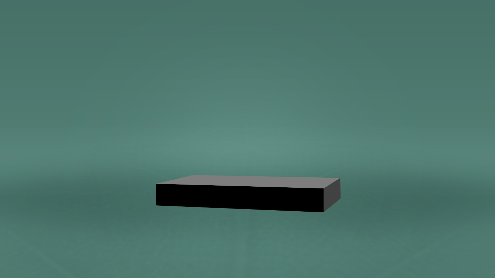

## Fleckchen Erde

Mit einer soliden Basis können wir nun die ersten externen Bilder platzieren. Diese sollten stets in hoher Auflösung vorliegen, ansonsten sind sie komplett unbrauchbar für Dateien, die später mal großflächig gedruckt werden. Außerdem solltest du so oft es geht Smart-Objekte nutzen! Wenn du nicht weißt warum: Lies es unbedingt nach – für einen guten Workflow sind sie elementar wichtig. Auch empfehle ich es dir deine Ebenen und Gruppen ordentlich zu benennen 😉 Unser erstes Bild für die Kante sieht wie folgt aus:

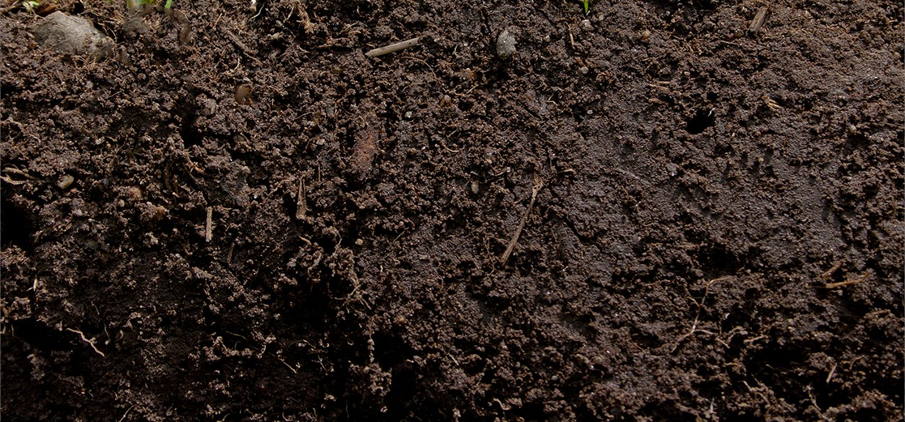

Für die lange Frontfläche ist das allerdings zu kurz; deshalb duplizieren wir die Ebene zweimal und erstellen mit Masken einen Übergang.

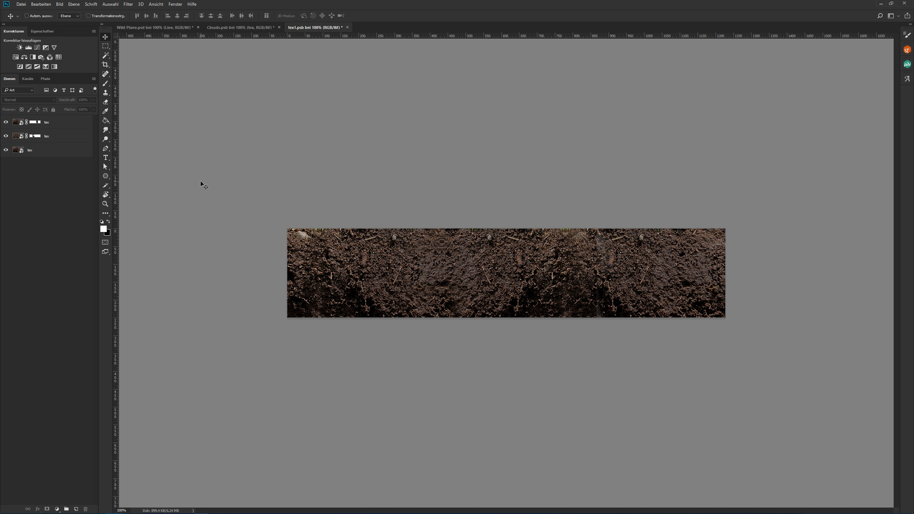

Allerdings sieht man so recht schnell, dass sich das Bild wiederholt – und das wollen wir nicht! Du kannst aber einiges dafür tun, dass es nicht auffällt:

-	Verfeinere den Übergang mit dem Stempel-Werkzeug
-	Ändere sich wiederholende Elemente ab, indem du sie transformierst
-	Bringe weitere Texturen mit ein (und überlagere diese ggfs.)
-	Bringe durch das Malen von Licht & Schatten Variation rein

Wie du im nachfolgenden Bild siehst wurden sowohl mehrere Texturen überlagert als auch ein Wolken-Filter im Ebenenmodus *Weiches Licht* genutzt.

Das gerade Stück Erde kannst du durch `Transformieren → Verzerren` anhand der 3D-Vorlage transformieren und solltest dieses Ergebnis dann sehen:

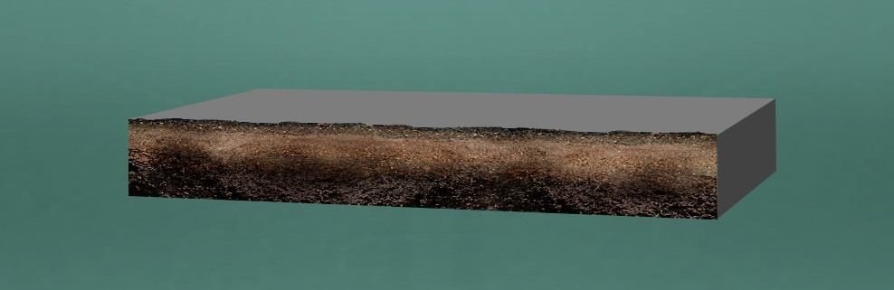

Weil eine solche Front mit geraden Kanten sowohl langweilig als auch unrealistisch aussieht, müssen wir die Kante maskieren und dem Element weitere Plastizität verleihen. Nimm das Lasso-Werkzeug und fahre mit zitternder Hand die Kante entlang – eine zackige, ungerade Kante entsteht dabei ganz von alleine.

Plastizität kann man immer durch das Verstärken von Licht & Schatten erzeugen/verstärken. Wichtig hierbei ist, dass man die globale (und lokale) Lichtquelle im Kopf behält und daraus resultierende Lichtpunkte/Schatten richtig einzeichnet. Im Verlauf des Tutorials werden wir ganz oft die Lichtsituation eines Elementes ändern, sodass sich dieses in das Gesamtbild einfügt. Nachfolgend ein paar Möglichkeiten, die ich nutze, um Licht & Schatten zu erzeugen:

-	Neue Ebene erstellen, auf dieser mit einem recht kleinen Pinsel mit Weiß und Schwarz malen, die Ebene mit dem *Gaußschen Weichzeichner* weichzeichnen und den Ebenenmodus auf *Normal* oder *Weiches Licht* einstellen und die Deckkraft minimieren
-	Mit gedrückter Alt-Taste eine neue Ebene erstellen und eine Ebene mit 50% Grau erstellen im Ebenenmodus *Weiches Licht*, mit dem Abwedler & Nachbelichter in die Ebene malen (siehe Bild)
-	Mit Einstellungsebenen wie z.B. der Gradationskurve kannst du auch das Bild abdunkeln/aufhellen und dann diese Ebene maskieren

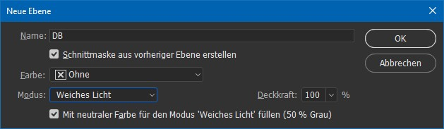

Achte bitte darauf, dass die Tonwerte nicht zu stark verfälscht werden – das passiert häufig wenn *Ineinanderkopieren* mit voller Power genutzt wird. Oft wirkt eine Ebene im Modus *Normal* mit niedriger Deckkraft natürlicher. Alternativ kannst du die Gradationskurven auch in den Modus *Luminanz* stellen. Der Unterschied ist sofort sichtbar:

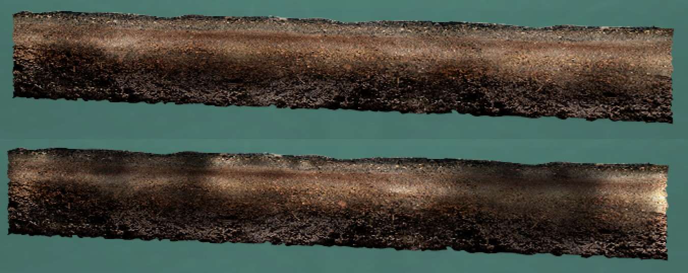

---

Compositings leben von kleinen Details, die du an vielen Ecken einbringen kannst. Das macht die Bildbearbeitung zwar sehr zeitintensiv, allerdings lohnt es sich! Besonders auf größeren Bildern beleben solche Elemente das Kunstwerk. Im Falle unseres Beispiels habe ich die Zweige eines Baums genommen und sie als Wurzel weiterverwendet. Außerdem habe ich wieder die Kante mit dem Lasso-Werkzeug abbröckeln lassen und eine Lichtkante erstellt (Links hell, rechts dunkel).

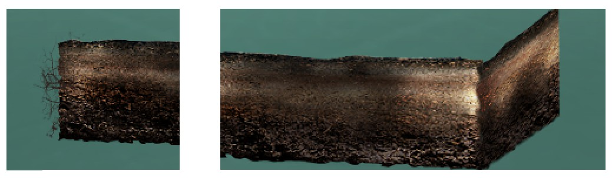

Nun kommen wir zum oberen Teil des Quaders: Der Rasen. Das Stock-Foto hat passenderweise schon eine einigermaßen korrekte Perspektive (eine Drauf-Sicht würde wohl nicht funktionieren), das Foto habe ich nur noch etwas weiter perspektivisch transformiert. Die Basis der Maske war das obere Element des Quaders, die Kanten kannst du mit einem Rasenpinsel (Photoshop hat standardmäßig zwei installiert) bearbeiten.

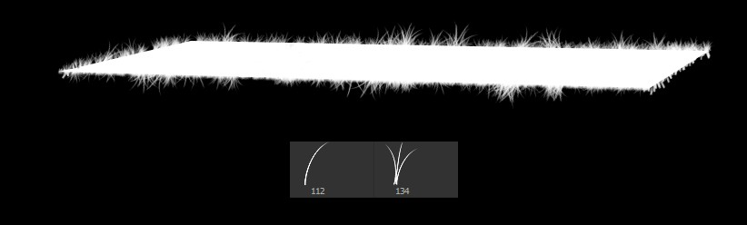

Somit steht der Rasen an allen Kanten etwas über und wir können wieder mit Licht & Schatten arbeiten. Sowohl im Rasen als auch wieder an der Erde kannst du Schatten einmalen, beispielsweise direkt an der Kante zwischen Erde und Rasen. Da der Rasen übersteht, fällt darunter ein Schatten (man beachte die globale Lichtquelle!). Unser bisheriges Ergebnis sieht dann so aus:

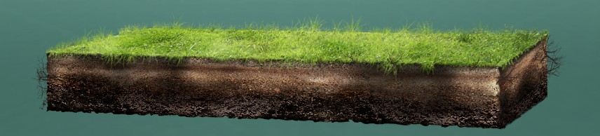

## Landschaft

Wenn man seine Bilder nicht selber fotografiert, ist die Wahrscheinlichkeit hoch, dass das Stock-Bild nicht hundertprozentig passend ist. Allerdings kann man sich mit einigen Tricks helfen, um das Bild doch nutzen zu können. Neben dem normalen Transformieren gibt es auch das *Formgitter* - und das leistet meistens einen sehr guten Job!

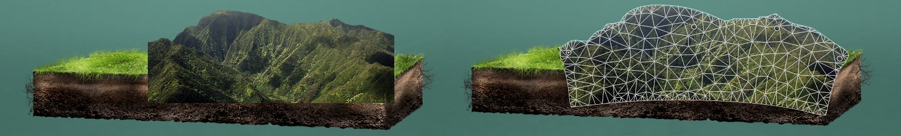

Auch meine zweite Bergreihe habe ich durch Maskieren und Nutzung des Formgitters in Form gebracht. Wie in den Schritten vorher erklärt, solltest du die hellen und dunklen Bereiche herausarbeiten bzw. anpassen, wenn diese nicht stimmen. Den Rasenpinsel kannst du wieder nutzen, um die Berge unten zu maskieren.

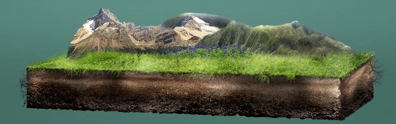

Das gleiche Spiel bei den Tieren: Passe die Lichtsituation an, zeichne ggfs. Lichtkanten ein oder erstelle eine Bewegungsunschärfe. Letztere erstelle ich immer auf einer separaten Ebene darunter, da ich gerne zwei Bewegungsunschärfen nutze (die längere mit geringer Deckkraft).

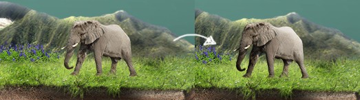

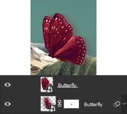

Wende die gelernten Techniken auch bei den Pflanzen an:

## Wanderer

Zugegebenermaßen ist die Freistellung dieser Person keine Herausforderung, da der Kontrast zwischen Hintergrund und Wanderer groß genug ist. Nichtsdestotrotz kannst du auch hier den Standardablauf durchgehen:

-	Stelle die Person grob frei, z.B. mit dem Lasso Werkzeug und lege dahinter einen farbigen Hintergrund, der dich „Blitzer“ (also Teile vom ursprünglichen Hintergrund) leicht erkennen lässt
-	Nimm das *Schnellauswahl-Werkzeug* bei sehr eindeutigen Kanten, das *Pfad-Werkzeug* in allen anderen Fällen
-	Nutze den *Maske verbessern* (bzw. „Verbessern: Auswählen und Maskieren…“) Dialog!
-	Füge eine leichte Weiche Kante hinzu, bisschen Kontrast und in den meisten Fällen ist noch ein negativer Wert zu *Kante verschieben* sinnvoll
-	Sollten schwierigere Elemente an der Kante sein, kann Photoshop bei der Kantenerkennung Hilfe anbieten. Hier unbedingt *Smartradius* aktivieren

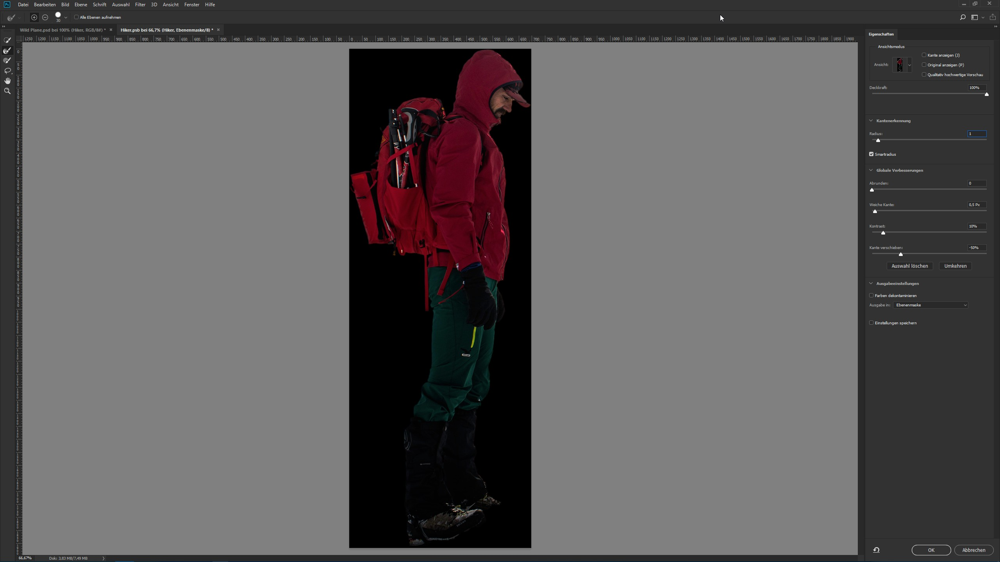

Zum Haare freistellen gibt es schon unzählige Tutorials, deshalb hier nur eine kurze Anmerkung: Malt die Haare im Zweifel selber ein mit einem Pinsel anstatt komische Artefakte zwischen den Haaren zu haben!

Wenn die Lichtquelle direkt in die imaginäre Kamera scheint oder zumindest in die Richtung, bieten sich Lichtkanten an. So geschehen am Wanderer:

## Details

Um gute Compositings erstellen zu können, solltest du auch deine Umwelt beobachten und genau hinschauen. Aus der Beobachtung kann man viel lernen und in seine Bilder übertragen. Einer der „Tricks“ ist es den Dunst zu beachten: Objekte werden umso entsättigter und heller (auf Ebenen angewandt: Die Deckkraft sinkt), desto weiter sie weg sind, da der Dunst/Dreck in der Luft unsere Sicht auf das Objekt zunehmend behindert.

Das Bild ist nun nach hinten hin nicht allzu lang, die Technik kannst du aber auch auf große Landschaftsbilder anwenden, die eine größere Entfernung abbilden. Im Grunde kannst du es dir so vorstellen:

-	Sei dir bewusst, dass es in deinem Bild verschiedene Tiefenebenen gibt und in welcher Ebene jeweils deine Elemente liegen (unser Elefant steht eindeutig vor den Bergen)
-	Erstelle an verschiedenen Positionen in deiner Ebenen-Hierarchie Ebenen, um auf diesen Dunst und/oder Wolken etc. einzumalen
-	Nutze dabei die Möglichkeiten der „Verdeckung“ (siehe Bild). So entsteht noch mehr Tiefe

Dunst lässt sich im Übrigen sehr einfach malen: Nimm einen Pinsel mit weißer Farbe, großen Radius und einer Deckkraft von 2-5%.

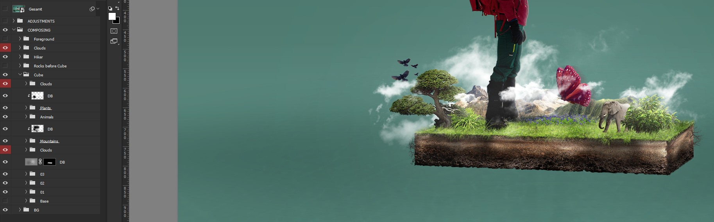

Wenn noch nicht geschehen solltest du zu diesem Zeitpunkt auch die Gelegenheit nutzen alle Elemente auf Schatten zu überprüfen – Elementen dürfen keine Schatten fehlen! Ich habe hier die Erfahrung gemacht, dass meistens Ebenen im Modus *Normal* und geringer Deckkraft am besten aussehen. Auch hier wieder die Devise: Beobachtet eure Umwelt und bildet den Schatten nach. Ein gutes Tutorial hierzu hat [RAWExchange](https://www.rawexchange.de/realistische-schatten-in-photoshop/) veröffentlicht.

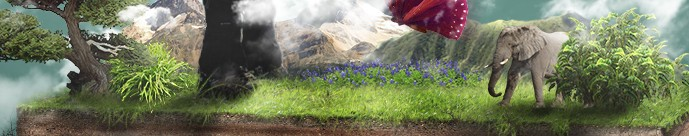

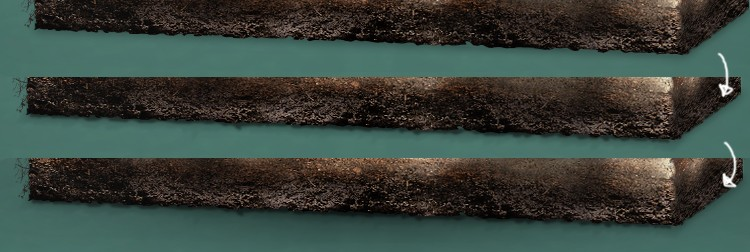

An der Kante habe ich zuerst einen kleinen, deutlichen Schatten hinzugefügt, dann mit der Form der Kante selber (also zackig) einen weiter abfallenden Schatten erstellt (Variation) und schlussendlich einen größeren, weichen Schatten mit geringer Deckkraft erzeugt. An Kanten fallen Schatten ab – auch das können wir so imitieren:

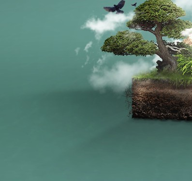

---

Gerne verstärke ich den „Vordergrund-Mittelgrund-Hintergrund“-Effekt, indem ich in den Vordergrund Störer einbaue. Was ein sehr beliebtes Mittel in der Fotografie ist, macht auch Compositings interessanter. In unserem Fall sind das umherwirbelnde Blätter, die Dynamik ins Bild bringen. Achte auch hier auf die kleinen Details! Das Blatt hat bei solch einem Wind bestimmt keinen geraden Stängel; und wird deshalb auch transformiert.

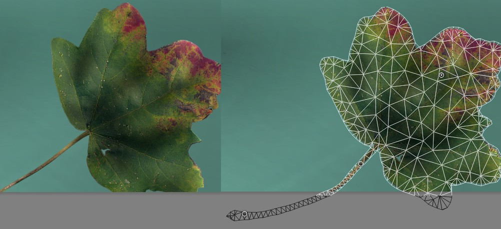

Seit ein paar Photoshop-Versionen gibt es den Filter *Pfad-Weichzeichnung* und für solche Zwecke ist er wunderbar geeignet:

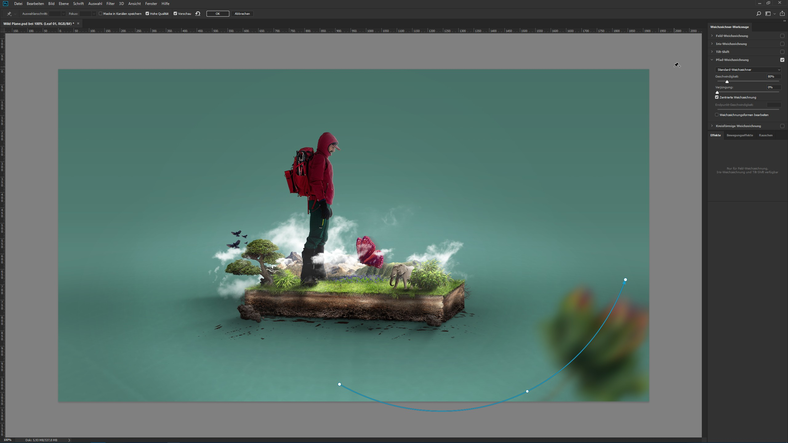

Sollte dir das Ergebnis später nicht gefallen, kannst du es immer noch problemlos ändern. Natürlich gesetzt dem Fall, dass du Smart-Objekte nutzt.

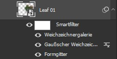

Ich habe dir bereits einige Techniken beigebracht, mit denen du deine Elemente variieren kannst. Warum ist Variation so wichtig? Weil es sehr schnell auffällt, wenn Objekte mehrmals kopiert und wieder eingefügt wurden – unser Gehirn sucht nach solchen Ähnlichkeiten. Bei den Blättern habe ich sowohl den Grad des Weichzeichnens als auch die Geschwindigkeit variiert. Die Blätter mit den Punkten haben keine Pfad-Weichzeichnung erhalten, da diese just in dem Moment keinen Windstoß abbekommen haben, sondern nur langsam sich bewegen. Auch sind Blätter näher an der virtuellen Kamera stärker weichgezeichnet als Blätter, die in der Nähe vom Schärfepunkt (dem Wanderer) liegen.

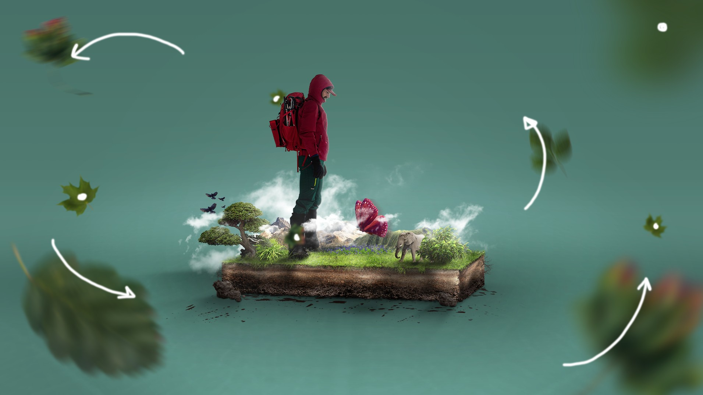

Nach weiteren Anpassungen sieht unser Endresultat wie folgt aus:

## Zusammenfassung

- Das Dokument in richtiger Größe und Auflösung anlegen
- Auf farbigem Hintergrund/50% Grau arbeiten
- 3D Tools nutzen, um perspektivisch korrekte Formen zu erstellen
- Smart-Objekte nutzen und Ebenen/Gruppen ordentlich benennen
- Texturen können wiederholt werden, sollten dabei aber variiert und angepasst werden
- Licht & Schatten ist ein wichtiges Kernelement, das es zu beachten gilt
- Kleine Details füllen ein Compositing mit Leben
- Die "Tiefe" eines Bildes herausarbeiten
- Mit "Störern" und Bewegung dem Bild Dynamik geben