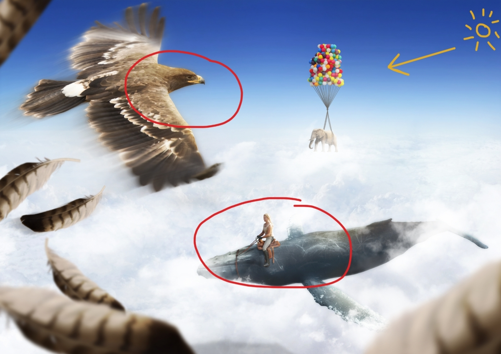
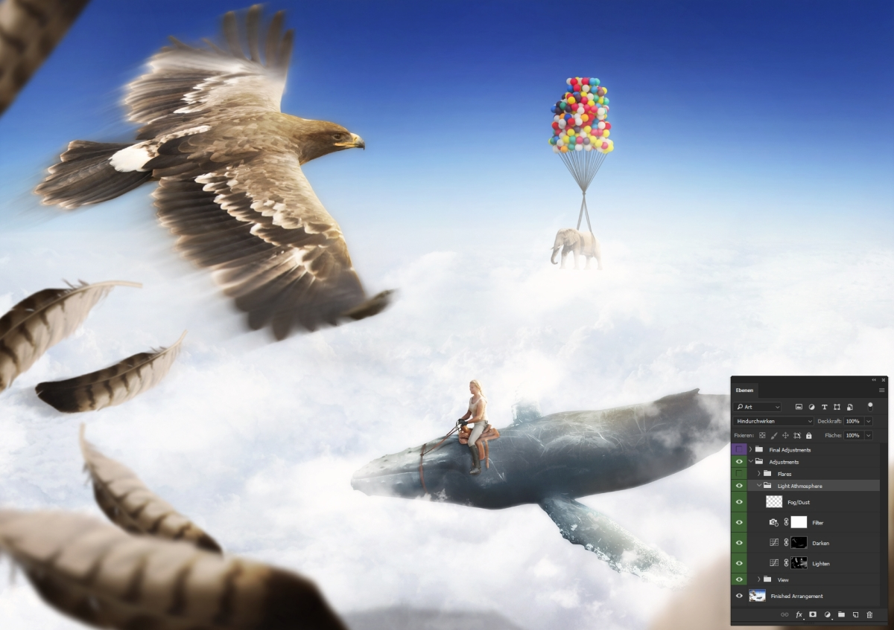
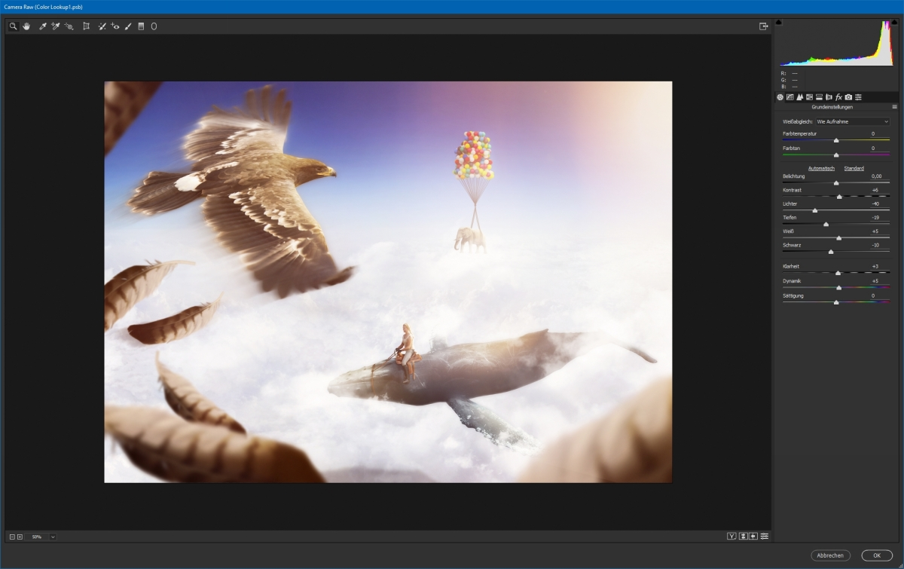
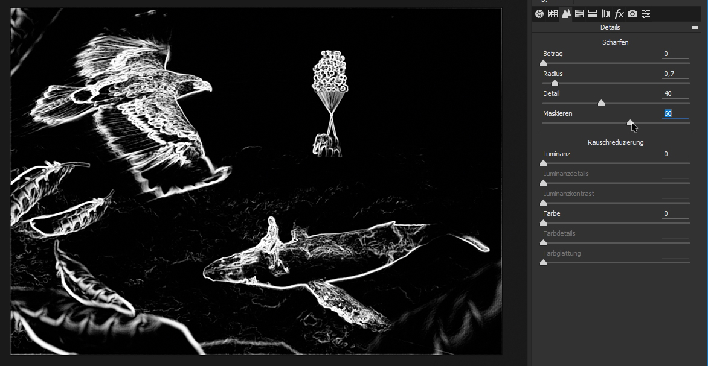
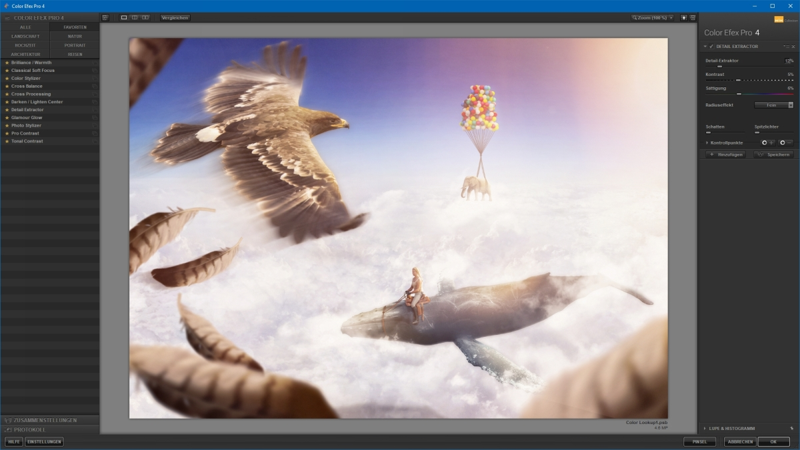
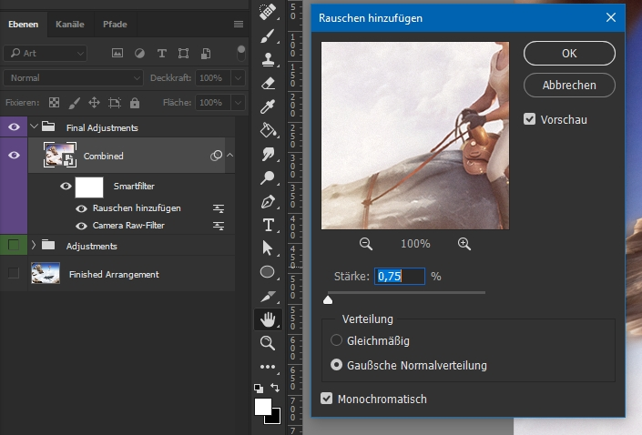

Um die Compositing Basics Reihe gebührend abzuschließen, geht es in diesem Teil um die Fertigstellung bzw. Vollendung des Compositings. Nachdem du fleißig [skizziert](/blog/photoshop-compositing-basics-konzeption), [gesucht](/blog/photoshop-compositing-basics-stockfotos) und in Photoshop [gearbeitet](/blog/photoshop-compositing-basics-bildcollage) hast, siehst du nun eine fertige Bildcollage vor dir, der aber noch der letzte Schliff fehlt. Immerhin ist es nicht selbstverständlich, dass viele, teils sehr unterschiedliche Bilder sich zu einem Gesamtbild zusammenfügen. Daher gebe ich dir meine Tipps & Tricks mit, um ein stimmungsvolles Endresultat zu erzielen.

Die Möglichkeiten erkläre ich anhand des Bildes *Eagle*. [Patreon-Nutzer](https://www.patreon.com/lekoarts) können die Photoshop-Datei herunterladen, um die Anpassungen direkt ausprobieren und sehen zu können.

### Ausgangssituation

Wie im [Bildcollage](/blog/photoshop-compositing-basics-bildcollage)-Teil erklärt wurde, solltest du beim Zusammenfügen der Bilder bereits darauf achten, dass Lichtstimmung, Größenproportionen und Perspektiven stimmig sind. Am Ende solltest du in etwa ein Resultat wie das gezeigte haben, nämlich eines bei dem noch der „Look“ fehlt.

## Tipp 1: Lichtstimmung

In der Skizze wurde bereits festgehalten, dass die Sonne von rechts oben kommen soll und unser Fokus auf dem Adler und dem Wal liegen soll. Genau diese Überlegungen kannst du durch weitere Anpassungen nun umsetzen:

Eine beliebte und effektive Methode ist die Vignette, bei der der Rand abgedunkelt und optional die Mitte aufgehellt wird.

Mit der Filter-Einstellungsebene kann man bereits einen leichten Farbstich einbauen (in diesem Fall ein Orange bei geringer Deckkraft), auch kann man noch Dunst einmalen.

Im Internet gibt es viele kostenlose und kostenpflichtige „Lens Flare“-Pakete, die sich wunderbar dafür eignen um hier die Sonne zu imitieren. Diese Bildfehler – was Lens Flares eigentlich sind – täuschen eine Lichteinstrahlung in die virtuelle Linse vor und geben in diesem Fall dem Bild noch einmal einen deutlichen Farbstich. Es muss nicht immer so extrem sein, ich persönlich füge diese Effekt-Ebenen aber immer sehr gerne in meine Bilder ein. Natürlich sind in Effekt-Ebenen auch andere Stock-Bilder miteingeschlossen, z.B. gibt es auch solche Bilder von Regen, Staub, Rauch etc.

## Tipp 2: RAW-Filter

Mit dem RAW-Entwickler (Camera RAW) kann man nicht nur Kamera-Rohdaten, sondern per Filter auch ganz normale Bilder bzw. Ebenen bearbeiten. Durch die vielen Einstellungsmöglichkeiten – die teilweise so gar nicht in Photoshop selber zu reproduzieren sind – kann am Look gefeilt und in Vorbereitung auf den Export das Bild geschärft werden.

Im gezeigten Bild ist tatsächlich ein leicht abgeändertes Setup zu sehen als ich normalerweise nutze: Um dem Bild mehr Dynamikumfang (leichter HDR-Look) zu geben, ziehe ich oft die *Lichter* runter und die *Tiefen* hoch und passe anschließend die Slider *Weiß/Schwarz* an, damit das Bild nicht zu flau wird. Allerdings war mir in diesem Fall das Bild bereits teilweise zu hell, weshalb ich darauf verzichtet habe. Bereits der erste Tab ist mit diesen Möglichkeiten extrem cool, um das Bild weiter zum finalen Look zu bewegen.

Wie auch bei vielen anderen Reglern in Camera RAW (und auch in Lightroom) kannst du mit Drücken der Alt-Taste weitere Optionen anzeigen lassen; im Falle des Schärfens wird beim Maskieren per Maske angezeigt wie die Schärfung angewendet wird (nur die weißen Kanten werden geschärft). **Anmerkung:** Schärfen ist im Prinzip nur das Erhöhen von lokalen Kontrasten (an Kanten), deshalb werden diese in der Maske auch markiert.

Ein ebenfalls einfacher wie wirksamer Tab ist die *Teiltonung*. Hier kannst du die *Lichter/Schatten* einfärben, so z.B. die *Lichter* gelblicher, die *Schatten* bläulicher und damit einen Farbkontrast erzeugen. Mit gedrückter Alt-Taste kann man beim *Farbton* eine Vorschau für das gesamte Bild sehen.

## Tipp 3: Externe Plugins

Vorweg: Solche Plugins sind kein Muss, aber sicherlich ein Nice-to-have. Ich nutze sehr gerne die – mittlerweile kostenlose – [Nik-Collection](www.google.de/intl/de/nikcollection/), um *Color Efex Pro* anzuwenden. Mit dem *Detail-Extractor* kann ich in einzelnen Strukturen (z.B. Federn) noch ein paar Details rauskitzeln, mit dem  *Glow/Soft Focus* noch ein bisschen die Sonne verstärken.
**Ganz wichtig:** Nicht mit den Filtern übertreiben! Damit kann man sich auch ganz schnell das Bild ruinieren.

## Tipp 4: Rauschen hinzufügen

Es mag vielleicht erst nicht ganz logisch klingen, aber das Hinzufügen von Rauschen am Ende kann noch einmal die Kirsche auf die Sahnetorte setzen. Warum? Weil sich all die verschiedenen Bilder auch im Rauschen unterscheiden! Manche Bilder haben nahezu keins, andere schon stärker – und so etwas kann auffallen.

Wenn du am Ende ein moderates Rauschen (0,5 % - 1,5 %) hinzufügst, gleicht sich auch das Rauschen automatisch an. Das Rauschen selber fällt in den Bereichen nicht auf, schon gar nicht wenn das Bild ausgedruckt von weiterer Entfernung betrachtet wird.