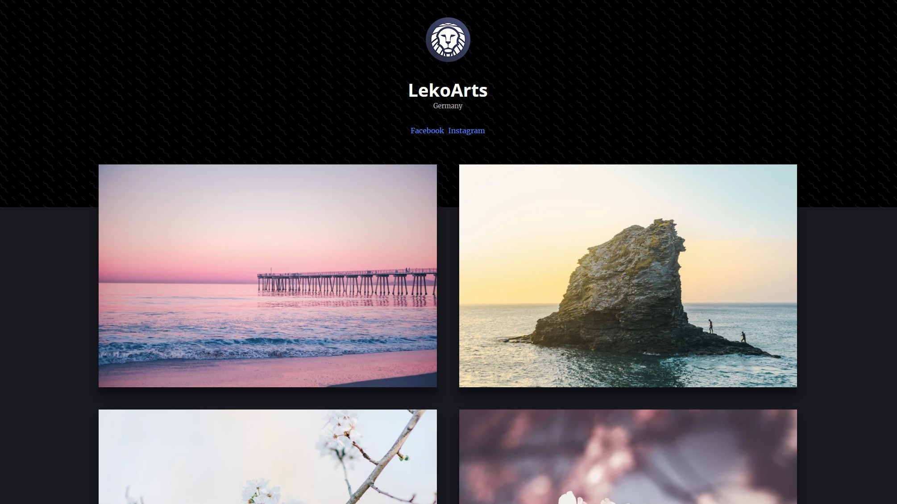

Für den auf React basierenden Static-Site-Generator [Gatsby](https://www.gatsbyjs.org/) habe ich heute meinen zweiten "Starter" veröffentlicht! Nachdem mein [vorheriger](/blog/gatsby-starter-portfolio) Starter ein helles Theme hatte, habe ich mich dieses Mal an dunkle Töne gewagt und den Fokus auf die Fotos gelegt. Das Theme *Emilia* hat hierbei alles, was ein schönes Portfolio für Fotografen braucht: Eine kurze Info inklusive Kontaktdaten zum Fotografen, große Bilder und eine gute Übersicht über eben diese. Wenn du schnell dein Projekt starten willst, ist das die perfekte Wahl für dich. Du kannst das Projekt leicht anpassen und erweitern.



Folgende Features hat die Seite:
- [Styled Components](https://www.styled-components.com/)
- [React Overdrive](https://react-overdrive.now.sh/)
- [CSS Grid](https://mozilladevelopers.github.io/playground/css-grid) für die Bild-Übersicht
- [HeroPatterns](http://www.heropatterns.com/) als Muster für den Headerbereich
- Passende Bildergrößen für jeden Bildschirm (durch [gatsby-image](https://github.com/gatsbyjs/gatsby/tree/master/packages/gatsby-image))
- Ganz viel SEO und [PWA](https://developers.google.com/web/progressive-web-apps/) Kram!

Eine Live-Vorschau gibts [hier](https://portfolio-emilia.netlify.com)!

Ganz schön viele Buzzwords! Bei genügend Interesse kannst du den Links ja folgen, ansonsten sei dir gesagt: Die Seite ist super schnell auf allen Geräten und eine tolle Möglichkeit, um deine Bilder zu zeigen.

Hinweise zur Installation und Nutzung kannst du dem [Github Repository](https://github.com/LeKoArts/gatsby-starter-portfolio-emilia) entnehmen. Wenn du die [Gatsby CLI](https://www.gatsbyjs.org/docs/) bereits installiert hast, kannst du hiermit den Starter installieren:

```bash
gatsby new project-name https://github.com/LeKoArts/gatsby-starter-portfolio-emilia
npm run dev
```