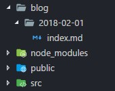
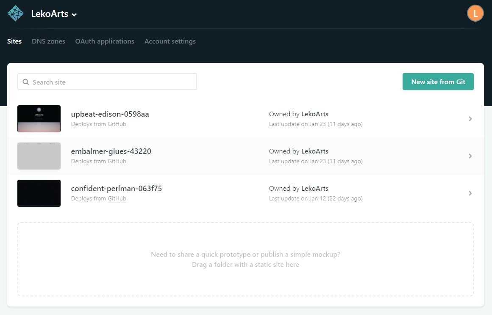

Gatsby ist ein blitzschneller *Static Site Generator* basierend auf [React](https://reactjs.org/). Wer keine Lust auf ein großes CMS wie Wordpress hat, aber dennoch gerne etwas mehr als reine HTML-Seiten bearbeiten will, wird [Gatsby](https://www.gatsbyjs.org/) sicherlich lieben (natürlich muss man auch React mögen). Gatsby erfüllt alle Ansprüche an eine [Progressive Web App](https://developers.google.com/web/progressive-web-apps/) (PWA), gibt per [GraphQL](http://graphql.org/) Zugriff auf verschiedene Datenimporte und hat durch Code-Splitting und Service Worker extrem schnelle Ladezeiten. Durch den Einsatz eines *Headless CMS* wie zum Beispiel [Contentful](https://www.contentful.com/) oder [Netlify CMS](https://www.netlifycms.org/) kann man Wordpress auch komplett ersetzen.

Ziel dieses Tutorials ist es einen funktionierenden Blog mit Artikel-Übersicht und Markdown-Unterstützung zu erstellen. Am Ende wirst du eine einfach gehaltene (neudeutsch: minimal) Website innerhalb von circa 15 Minuten erstellt haben. Dem Tutorial begleitend gibt es ein öffentliches [GitHub Repository](https://github.com/LeKoArts/gatsby-starter-minimal-blog) und eine [Demo-Website](https://minimal-blog.netlify.com/). Da ich den Blog in weiteren Tutorials sukzessive erweitern will, bekommt jeder Teil einen eigenen Branch. Die Demo-Website bildet dann den aktuellen Stand des Master Branches ab.
Das Endresultat des Tutorials findest du im Branch [tutorial-part-one](https://github.com/LeKoArts/gatsby-starter-minimal-blog/tree/tutorial-part-one).

**Hinweis:** Gatsby selber bietet eine hervorragende Dokumentation und Tutorials auf Englisch an. Um noch andere Möglichkeiten (z.B. anderes CSS) kennenzulernen solltest du unbedingt die [Website](https://www.gatsbyjs.org/) besuchen.
Um diesen und nachfolgenden Tutorials folgen zu können, solltest du bereits Grundkenntnisse in React haben.

# Inhaltsverzeichnis

1. [Starten](#starten)
2. [Konfiguration und Plugins](#konfiguration-und-plugins)
3. [Layout](#layout)
4. [Blogposts mit Markdown erstellen](#blogposts-mit-markdown-erstellen)
5. [Startseite mit Artikel-Übersicht füllen](#startseite-mit-artikel-%C3%9Cbersicht-f%C3%BCllen)
6. [Export und Hochladen](#export-und-hochladen)

## Starten

Installiere eine aktuelle Version von Node.js auf deinem Computer oder checke deine Version im Terminal mit `node --version`. Der Paketmanager *npm* wird dann gleich mitgeliefert.
Außerdem solltest du das Gatsby CLI installieren, um sog. *Starter* (vorkonfigurierte Gatsby Projekte) bequem herunterladen zu können. Öffne dein Terminal und gebe ein:

```bash
npm install --global gatsby-cli
```

Die CLI bietet bislang drei Kommandos:
- `gatsby new` : Erstellt ein neues Gatsby Projekt
- `gatsby develop` : Startet den lokalen Server
- `gatby build` : Erstellt eine fertige Version zum Hochladen

Navigiere anschließend zu deinem gewünschten Ziel-Order und erstelle mit Hilfe des CLI ein neues Projekt ("gatsby-one" ist der Name des Ordners):

```bash
gatsby new gatsby-one
```

Am Ende solltest du diese Elemente in deinem Ordner haben:


## Konfiguration und Plugins

Gatsby ist bereits von Haus aus sehr gut konfigurierbar und mit Plugins erweiterbar. Um im späteren Verlauf u.a. Markdown nutzen zu können, musst du vorher erst diverse Plugins installieren und anpassen. Öffne hierzu wieder dein Terminal und installiere mit npm folgende Pakete:

```bash
npm install gatsby-plugin-catch-links gatsby-plugin-lodash gatsby-plugin-offline gatsby-plugin-typography gatsby-remark-autolink-headers gatsby-remark-external-links gatsby-source-filesystem gatsby-transformer-remark
```

Uff... Das sind viele Plugins. In der offiziellen Übersicht kannst du im Detail nachlesen, was diese bewirken - für uns sind die Details momentan noch nicht interessant.

Alle Plugins werden in der Datei `gatsby-config.js` aktiviert und konfiguriert.

```JS
module.exports = {
  plugins: ["gatsby-plugin-react-helmet"],
};
```

Es wurde bereits automatisch ein Plugin in die Liste eingetragen, jetzt folgen die gerade installierten Plugins. Zuerst teilen wir Gatsby mit, wo es unsere Markdown-Dateien erwarten kann und geben diesem Verzeichnis einen einzigartigen Namen:

```JS
module.exports = {
  plugins: [
    "gatsby-plugin-react-helmet",
    {
      resolve: "gatsby-source-filesystem",
      options: {
        name: "post",
        path: `${__dirname}/blog`,
      },
    },
  ],
};
```

*Remark* wird es später sein, das diese Dateien zu gültigem HTML verarbeitet. `gatsby-source-filesytem` nimmt Optionen und weitere Plugins entgegen.

```JS
    {
      resolve: "gatsby-transformer-remark",
      options: {
        plugins: [
          {
            resolve: "gatsby-remark-external-links",
            options: {
              target: "_blank",
              rel: "nofollow noopener noreferrer"
            }
          },
          "gatsby-remark-autolink-headers"
        ]
      }
    }
```

Um bequem Google Fonts nutzen zu können nehmen wir [Typography.js](https://kyleamathews.github.io/typography.js/).

```JS
    {
      resolve: "gatsby-plugin-typography",
      options: {
        pathToConfigModule: "src/utils/typography.js",
      },
    },
```

Innerhalb des `src` Ordners erstellst du einen neuen Ordner namens `utils` und dort die Datei `typography.js`. Hiermit können wir Typography.js konfigurieren und z.B. unsere Google Fonts festlegen. Zuerst importieren wir das Paket, erstellen dann ein neues Objekt und übergeben diesem unsere Einstellungen:

```jsx
import Typography from "typography";

const typography = new Typography({
  title: "Minimal",
  baseFontSize: "16px",
  baseLineHeight: 1.66,
  scaleRatio: 3.66,
  headerFontFamily: ["Bitter", "sans-serif"],
  bodyFontFamily: ["Open Sans", "sans-serif"],
  headerWeight: 700,
  googleFonts: [
    {
      name: "Bitter",
      styles: ["700"]
    },
    {
      name: "Open Sans",
      styles: ["400"]
    }
  ]
});

// Hot reload typography in development.
if (process.env.NODE_ENV !== "production") {
  typography.injectStyles();
}

export default typography;
```

Anschließend fügen wir noch drei weitere Plugins hinzu, sodass am Ende unsere `gatsby-config.js` Datei wie folgt aussieht:

```JS
module.exports = {
  plugins: [
    "gatsby-plugin-react-helmet",
    {
      resolve: "gatsby-source-filesystem",
      options: {
        name: "post",
        path: `${__dirname}/blog`
      }
    },
    {
      resolve: "gatsby-transformer-remark",
      options: {
        plugins: [
          {
            resolve: "gatsby-remark-external-links",
            options: {
              target: "_blank",
              rel: "nofollow noopener noreferrer"
            }
          },
          "gatsby-remark-autolink-headers"
        ]
      }
    },
    {
      resolve: "gatsby-plugin-typography",
      options: {
        pathToConfigModule: "src/utils/typography.js",
      },
    },
    "gatsby-plugin-catch-links",
    "gatsby-plugin-offline",
  ]
};
```

## Layout

Starte den lokalen Server:

```bash
npm run develop
```

Am Ende solltest du folgende Nachricht sehen:

```bash
You can now view gatsby-starter-minimal-blog in the browser.

  http://localhost:8000/

View GraphiQL, an in-browser IDE, to explore your site's data and schema

  http://localhost:8000/___graphql

Note that the development build is not optimized.
To create a production build, use gatsby build
```

Nun haben wir einen lokalen *Hot-Reloading* Server, d.h. unsere Änderungen in den Dateien werden automatisch ohne manuelles Aktualisieren in der Live-Version zu sehen sein. Auch findest du unter `___graphql` den GraphiQL Editor, in dem du GraphQL Queries ausprobieren kannst. Sehr zu empfehlen, um die passende Query zu finden!

Das Layout sollte immer der Startpunkt in deinem Projekt sein. Hier definierst du globale Einstellungen, z.B. kannst du hier CSS-Dateien oder Meta-Tags setzen, die auf jeder Unterseite eingebunden werden sollen.
Öffne die `index.js` Datei, die im Ordner `src/layouts` zu finden ist. Fürs erste kannst du die Zeilen zu den *PropTypes* entfernen - wir werden diese in einem späteren Tutorial behandeln. Entferne die `Header` Komponente und das Styling am inneren Container. Unsere Datei sieht dann so aus:

```jsx
import React from "react";
import Helmet from "react-helmet";
import Footer from "../components/Footer";

import "./index.css";

const TemplateWrapper = ({ children }) => (
  <div>
    <Helmet
      title="Gatsby Starter Minimal Blog"
      meta={[
        { name: "description", content: "Gatsby Starter Minimal Blog" },
        { name: "keywords", content: "Gatsby, Starter, Minimal, Blog" }
      ]}
    />
    <div>{children()}</div>
    <Footer />
  </div>
);

export default TemplateWrapper;
```

Mit `Footer.js`:

```jsx
import React from "react";

const Footer = () => (
  <footer style={{ textAlign: "center", padding: "3rem 0" }}>
    &copy; 2018 by John Doe. All rights reserved.
  </footer>
);

export default Footer;
```

Ganz oben importieren wir nur React und Helmet als Komponenten, darunter unsere CSS Datei. `children` ist der Inhalt, der in unser Layout kommen wird - in diesem Fall sind es die Seiten im `src/pages` Ordner.

Ändere den inneren Container zu einem `<main>` Tag und gebe diesem einen Klassennamen. Achte darauf, dass du **nicht** `class` sondern `className` nutzen musst (da `class` ein reserviertes Wort in JS ist).

```jsx
<main className="layout">{children()}</main>
```

Den Inhalt der `index.css` kannst du komplett löschen, einen *CSS-Reset* erledigt Typography.js schon für uns. Zuerst wollen wir ein paar Grundeinstellungen festlegen:

```CSS
::selection {
  color: white;
  background: #d02e77;
}

html {
  background: #fff;
}

a {
  color: #d02e77;
  text-decoration: none;
  transition: color 0.5s;
}

a:hover {
  color: #624464;
}

/* Tablet */

@media (max-width: 1200px) {
  html {
    font-size: 15px;
  }
}

/* Phone */
@media (max-width: 600px) {
  html {
    font-size: 14px;
  }
}
```

Da wir unseren Inhalt mit einer variablen Breite zentrieren wollen, bietet sich die neue *CSS-Grid* Syntax an. Natürlich wäre auch ein `margin: 0 auto` möglich. An dieser Stelle möchte ich den [CSS-Grid Kurs von Wes Bos](https://cssgrid.io/) empfehlen, falls du tiefer in die Materie einsteigen willst.

```CSS
.layout {
  display: grid;
  grid-template-columns: 1fr minmax(320px, 1000px) 1fr;
}
```

Hier definieren wir insgesamt drei Spalten, die jeweils äußeren nehmen `1fr` Platz ein, wobei `fr` für *Fraction* steht. CSS-Grid nimmt immer erst absolute Werte (wie z.B. Pixel) und teilt danach die `fr` auf. Wir wollen unsere mittlere Spalte eine Größe von 320px bis 1000px geben, die Seite links und rechts wird dann jeweils aufgefüllt, falls noch Platz da seien sollte.

## Blogposts mit Markdown erstellen

Erstelle einen neuen Ordner `templates` innerhalb des `src` Ordners. Erzeuge dort eine Datei namens `post.js` - diese ist das Template für die Artikel-Ansicht und wird zur automatischen Erstellung der Seiten gebraucht. Wir erstellen wieder eine *Functional Stateless Component*:

```jsx
import React from "react";
import Link from "gatsby-link";
import styles from "./post.module.css";

const Post = props => {
  return (
    <article className={styles.blogPost}>
      <Link to="/">
        Gatsby Starter - Minimal Blog | Get back to the overview
      </Link>
      <div
        className={styles.content}
        dangerouslySetInnerHTML={{ __html: postNode.html }}
      />
    </article>
  );
};

export default Post;
```

Dieses mal importieren wir unser CSS etwas anders, nämlich indem wir das schon eingebaute [CSS-Modules](https://github.com/css-modules/css-modules) nutzen (`.module` muss vor dem `.css` stehen). Webpack gibt jeder Klasse einen einzigartigen Namen, sodass theoretisch jede React Komponenten die Klasse `.content` haben kann, aber es durch die verschiedenen Namen keine Überschneidungen gibt.

> A CSS Module is a CSS file in which all class names and animation names are scoped locally by default.

Die Voraussetzungen, dass `postNode.html` überhaupt Inhalt hat, schaffen wir jetzt. Dazu musst du den lokalen Server einmal beenden und die Datei `gatsby-node.js` öffnen.

Eine SEO-freundliche URL soll für alle Artikel automatisch erstellt werden, weshalb wir im ersten Schritt mit Hilfe von [lodash](https://lodash.com/) ein sog. `NodeField` für Gatsby erstellen. Dieses können wir in der späteren GraphQL Query dann abfragen:

```jsx
const path = require('path');
const _ = require('lodash');

exports.onCreateNode = ({ node, boundActionCreators }) => {
  const { createNodeField } = boundActionCreators;
  let slug;
  if (node.internal.type === 'MarkdownRemark') {
    if (
      Object.prototype.hasOwnProperty.call(node, 'frontmatter') &&
      Object.prototype.hasOwnProperty.call(node.frontmatter, 'slug')
    ) {
      slug = `/${_.kebabCase(node.frontmatter.slug)}`;
    }
    if (
      Object.prototype.hasOwnProperty.call(node, 'frontmatter') &&
      Object.prototype.hasOwnProperty.call(node.frontmatter, 'title')
    ) {
      slug = `/${_.kebabCase(node.frontmatter.title)}`;
    }
    createNodeField({ node, name: 'slug', value: slug });
  }
};
```

In den Markdown-Dateien definieren wir in der *Frontmatter* unseren Titel oder Slug (falls wir eine bestimmte URL haben wollen), der hier extrahiert, mit *lodash* in ein passendes Format gebracht und am Ende als `NodeField` definiert wird.

Gatsby bietet unter anderem auch eine API an, um automatisch Seiten (außerhalb von `src/pages`) mit Hilfe eines Templates zu erstellen. Zusammen mit der `createPages` Funktion sieht unsere `gatsby-node.js` wie folgt aus:

```jsx
const path = require("path");
const _ = require("lodash");

exports.onCreateNode = ({ node, boundActionCreators }) => {
  const { createNodeField } = boundActionCreators;
  let slug;
  if (node.internal.type === "MarkdownRemark") {
    if (
      Object.prototype.hasOwnProperty.call(node, "frontmatter") &&
      Object.prototype.hasOwnProperty.call(node.frontmatter, "slug")
    ) {
      slug = `/${_.kebabCase(node.frontmatter.slug)}`;
    }
    if (
      Object.prototype.hasOwnProperty.call(node, "frontmatter") &&
      Object.prototype.hasOwnProperty.call(node.frontmatter, "title")
    ) {
      slug = `/${_.kebabCase(node.frontmatter.title)}`;
    }
    createNodeField({ node, name: "slug", value: slug });
  }
};

exports.createPages = ({ graphql, boundActionCreators }) => {
  const { createPage } = boundActionCreators;

  return new Promise((resolve, reject) => {
    const postPage = path.resolve("src/templates/post.js");
    resolve(
      graphql(`
        {
          posts: allMarkdownRemark {
            edges {
              node {
                fields {
                  slug
                }
              }
            }
          }
        }
      `).then(result => {
        if (result.errors) {
          console.log(result.errors);
          reject(result.errors);
        }

        const posts = result.data.posts.edges;

        posts.forEach(edge => {
          createPage({
            path: edge.node.fields.slug,
            component: postPage,
            context: {
              slug: edge.node.fields.slug
            }
          });
        });
      })
    );
  });
};
```

`postPage` ist unsere Template-Komponente. In der GraphQL Query geben wir der Query den Alias `posts` und fragen den weiter oben definierten `slug` ab. Sollten dabei keine Fehler auftreten speichern wir das Ergebnis dieser Abfrage in der Variable `posts`. In der `createPage` Funktion übergeben wir drei Werte:

- path: Die schlussendliche URL
- component: Definieren der Komponente
- context: Es wird sozusagen der Wert weitergegeben (bieten einen "Kontext") und können somit diesen Wert als Variable in GraphQL Queries nutzen

Zurück in unserer `post.js` Datei erstellen wir die passende GraphQL Query:

```graphql
export const postQuery = graphql`
  query postBySlug($slug: String!) {
    markdownRemark(fields: { slug: { eq: $slug } }) {
      html
      frontmatter {
        title
        date(formatString: "DD.MM.YYYY")
      }
    }
  }
`;
```

Was passiert hier? Wir geben der Variable und Query einen Namen (der Name ist egal, er muss nur einzigartig sein) und teilen GraphQL mit, dass wir `slug` als Variable definieren, die ein *String* seien muss. Dieses `$slug` ist unser `slug` aus `gatsby-node.js`. Um nur eine Datei zurückzubekommen, **muss** die Variable und das interne Feld identisch sein - wir bekommen also nur jeweils die Daten zur passenden Datei zurück. `html` ist der gesamte Text, beim Datum können wir noch eine spezielle Formatierung angeben.

Nun wollen wir die Ergebnisse dieser Query in unserem Template einbauen. Öffne `post.js` und füge diese zwei Zeilen hinzu:

```jsx
const Post = props => {
  const postNode = props.data.markdownRemark;
  const post = postNode.frontmatter;
```

An die Daten der Query kommt man mit `props.data.markdownRemark`. **Tipp:** Falls du zwei markdownRemark Queries nutzen willst, kannst du wieder Aliase nutzen. Im Falle von `post: markdownRemark` würde man dann `props.data.post` nutzen. Das Template sollte dann so aussehen:

```jsx
import React from "react";
import Helmet from "react-helmet";
import Link from "gatsby-link";
import styles from "./post.module.css";

const Post = props => {
  const postNode = props.data.markdownRemark;
  const post = postNode.frontmatter;

  return (
    <article className={styles.blogPost}>
      <Helmet title={`${post.title} | Gatsby Starter - Minimal Blog`} />
      <Link to="/">
        Gatsby Starter - Minimal Blog | Get back to the overview
      </Link>
      <h1 className={styles.title}>{post.title}</h1>
      <h4 className={styles.date}>{post.date}</h4>
      <div
        className={styles.content}
        dangerouslySetInnerHTML={{ __html: postNode.html }}
      />
    </article>
  );
};

export default Post;

/* eslint no-undef: off */
export const postQuery = graphql`
  query postBySlug($slug: String!) {
    markdownRemark(fields: { slug: { eq: $slug } }) {
      html
      frontmatter {
        title
        date(formatString: "DD.MM.YYYY")
      }
    }
  }
`;
```

Wir haben den passenden Titel und Datum in unseren Elementen. Fehlt nur noch das Styling und unsere Markdown-Dateien. Die `post.module.css`:

```CSS
.blogPost {
  grid-column: 2;
  box-shadow: 0 0 120px rgba(0, 0, 0, 0.1);
  border-radius: 0 0 1rem 1rem;
  padding: 2rem 6rem;
}

.title {
  margin-top: 2rem;
}

.content {
  margin-top: 4rem;
}

aside {
  grid-column: 3;
}

/* Tablet */

@media (max-width: 1200px) {
  .blogPost {
    padding: 3rem 4rem;
  }
}

/* Phone */
@media (max-width: 600px) {
  .blogPost {
    padding: 2rem 1.5rem;
  }
}
```

Im Root-Verzeichnis `/` erstellst du nun den Ordner `blog` mit einem Unterordner `2018-02-01`. Hier drin dann eine Markdown-Datei mit ein bisschen Fülltext.



Markdown-Datei inklusive Frontmatter:

```markdown
---
date: "2018-01-01"
title: "Scittle Luo"
---

Hier kommt dein Fülltext hin
```

Starte mit `npm run develop` wieder den Server. Die Startseite sieht noch genauso aus wie vorher, aber rufe mal `http://localhost:8000/scittle-luo` auf. Tadaaaa. Der Inhalt unserer Datei in unserem Template!

## Startseite mit Artikel-Übersicht füllen

Bislang grüßt dich ein *Hi people* beim Aufruf der Startseite... Hier sollen unsere Artikel aufgelistet und darüber eine kleine Nachricht angezeigt werden. Beende den lokalen Server wieder und erweitere `src/pages/index.js` um diese Query:

```graphql
export const IndexQuery = graphql`
  query IndexQuery {
    allMarkdownRemark(sort: { fields: [frontmatter___date], order: DESC }) {
      edges {
        node {
          fields {
            slug
          }
          frontmatter {
            title
            date(formatString: "DD.MM.YYYY")
          }
          excerpt(pruneLength: 200)
        }
      }
    }
  }
`;
```

Wir sortieren die Liste absteigend nach Datum, holen uns Infos wie Pfad, Titel, Datum und einen Ausschnitt (HTML wird auf 200 Zeichen gekürzt ausgegeben).

Außerdem erstellen wir wieder eine CSS-Datei und das generelle Markup:

```jsx
import styles from './index.module.css';

const IndexPage = props => {
  const postEdges = props.data.allMarkdownRemark.edges;

  return (
    <div>
      <div className={styles.indexContent}>
        <div className={styles.hero}>
          <h1>Hi.</h1>
          <p>
            I&apos;m John Doe, a Senior UX Developer with five years of industry
            experience, specializing in developing React apps with the best UX
            users can get.
          </p>
        </div>
        /* Hier kommt nun unsere Übersicht hin */
      </div>
    </div>
  );
};
```

Die passende `index.module.css`:

```CSS
.indexContent {
  grid-column: 2;
  box-shadow: 0 0 120px rgba(0, 0, 0, 0.1);
  border-radius: 0 0 1rem 1rem;
  padding: 3rem 6rem;
}

.hero p {
  font-size: 1.68rem;
  margin-top: -1rem;
}

.hero {
  margin-bottom: 12rem;
  text-shadow: 0 12px 30px rgba(0, 0, 0, 0.15);
  color: #000;
}

/* Tablet */

@media (max-width: 1200px) {
  .hero p {
    font-size: 1.45rem;
  }
  .indexContent {
    padding: 3rem 3rem;
  }
}

/* Phone */
@media (max-width: 600px) {
  .hero p {
    font-size: 1.25rem;
  }
  .indexContent {
    padding: 2rem 1.5rem;
  }
}
```

React lebt von der Abstrahierung in Komponenten, weshalb wir für die Übersicht eine `Article.js` Komponente (+ CSS-Datei) erstellen:

```jsx
import React from "react";
import Link from "gatsby-link";

import styles from "./Article.module.css";

const Article = ({ title, date, excerpt, slug }) => {
  const firstChar = title.charAt(0);

  return (
    <article className={styles.post}>
      <h2 className={styles.title}>
        <span className={styles.initiale}>{firstChar}</span>
        <Link to={slug}>{title}</Link>
      </h2>
      <h4 className={styles.date}>{date}</h4>
      <p className={styles.excerpt}>{excerpt}</p>
    </article>
  );
};

export default Article;
```

Statt `props` nutzen wir dieses mal wieder direkt das *Destructuring* und greifen uns sofort die Informationen ab (andere Schreibweise für `props.title` etc.). In `firstChar` speichern wir den ersten Buchstaben des Titels.

```CSS
.post {
  display: grid;
  grid-template-columns: 3fr 1fr;
  align-items: center;
  margin-bottom: 4rem;
}

.initiale {
  position: absolute;
  font-size: 8rem;
  transform: translate(-50%, -50%);
  opacity: 0.05;
  user-select: none;
  z-index: -1;
}

.title {
  position: relative;
  margin-bottom: 0;
  text-shadow: 0 12px 30px rgba(0, 0, 0, 0.15);
}

.title a {
  color: hsla(0, 0%, 0%, 0.8);
}

.title a:hover {
  color: #d02e77;
}

.date {
  margin-bottom: 0;
  text-align: right;
}

.excerpt {
  grid-column: -1 / 1;
  margin-top: 1.35rem;
  margin-bottom: 0;
}
```

Wieder zurück in `pages/index.js` importieren wir die neue Komponente und nutzen sie, um unsere Liste zu erstellen:

```jsx
import Article from "../components/Article";

const IndexPage = props => {
  const postEdges = props.data.allMarkdownRemark.edges;

  return (
    <div className={styles.indexContent}>
      <div className={styles.hero}>
        <h1>Hi.</h1>
        <p>
          I&apos;m John Doe, a Senior UX Developer with five years of industry
          experience, specializing in developing React apps with the best UX
          users can get.
        </p>
      </div>
      {postEdges.map(post => (
        <Article
          title={post.node.frontmatter.title}
          date={post.node.frontmatter.date}
          excerpt={post.node.excerpt}
          slug={post.node.fields.slug}
          key={post.node.fields.slug}
        />
      ))}
    </div>
  );
};
```

Über das `postEdges` Array wird komplett einmal iteriert, die einzelnen Einträge kann man mit `post` beziehen. Unsere *Properties* an der Komponente füllen wir dann mit eben diesen Einträgen. Das `key` Property muss für React gesetzt werden.

Et voilà. Starte den Server neu und betrachte die schöne Startseite :)

## Export und Hochladen

Die lokale Version läuft und zum jetzt wollen wir natürlich dem Internet unseren schönen Blog präsentieren. Beende den Server und führe `npm run build` aus. Gatsby nimmt nun alle Dateien/Queries, minimiert diese und erstellt die allgemeine Struktur. Den Inhalt des Ordners `public` kannst du per FTP auf deinen Host hochladen.

Aber...

Das ist auf Dauer ziemlich umständlich. Immerhin muss bei jeder Änderung oder bei jedem neuen Artikel die Seite neu erstellt und hochgeladen werden. Der einfachste Weg dies zu automatisieren ist [Netlify](https://www.netlify.com/).

Nachdem du einen kostenlosen Account erstellt hast, siehst du diese Übersicht:



Mit dem Button **New site from Git** kannst du direkt dein GitHub/GitLab/BitBucket Repository auswählen (wenn du kein Git benutzt, solltest du das schleunigst ändern :P). Netlify erkennt automatisch, dass der Befehl `gatsby build` lautet und der `public/` Order ausgegeben werden soll. Per **Deploy site** Button ist die Seite ganz schnell live.