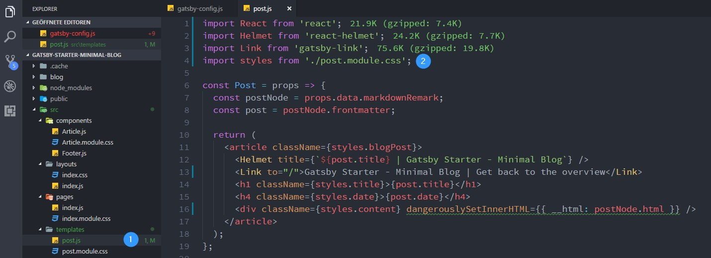

Nachdem wir im [ersten Teil](/blog/ultra-schnellen-blog-mit-react-und-gatsby-erstellen) unseren Gatsby Blog erstellt und veröffentlicht haben, wird es in den folgenden Teilen darum gehen diesen mit Funktionen stetig zu erweitern. Im Laufe der Tutorials wirst du einiges an React Code schreiben müssen - und dabei schleichen sich immer wieder gerne Flüchtigkeitsfehler in den Code ein. Schlaue Entwickler haben sich für dieses Problem sog. _Linter_ und _Code Formatter_ ausgedacht, die deinen Code auf Fehler bzw. falsche Formatierung prüfen und dies dann korrigieren. Vor allem bei Teamarbeiten kann so ein konsistenter Stil eingehalten werden.

In diesem kurzem Blog-Eintrag soll es nun also um [ESLint](https://eslint.org/), [Prettier](https://prettier.io/) + [Visual Studio Code](https://code.visualstudio.com/) gehen. Mein persönliches Setup ist natürlich nicht Gatsby-spezifisch, passt aber gut in die Tutorial-Reihe hinein.

## Kurzinfo zu ESLint und Prettier

ESLint ist ein _Linter_ und prüft vorrangig deinen Code auf Bugs und die Anwedung von bestimmten ECMAScript Mustern. Das können bspw. Warnungen zu ungenutzen Variablen oder Imports sein, aber auch Hinweise auf bewährte Praktiken wie z.B. die Nutzung von _Functional Stateless Components_ in React.

Prettier ist ein _Code Formatter_ und passt den Code deinem Styling Geschmack an. Du möchtest keine `;` hinter den Zeilen oder möchtest `'` statt `"` nutzen? Kein Problem. Prettier achtet darauf, dass diese Sachen überall eingehalten werden und korrigiert sie gegebenenfalls. Prettier kann auch CSS & SCSS formatieren!

Ich möchte hier keines der beiden Tools vollständig erklären. Wenn du also mehr lernen willst, empfehle ich dir die jeweilige Dokumentation zu lesen.

## Visual Studio Code

Da [Visual Studio Code](https://code.visualstudio.com/) der Editor meiner Wahl ist, soll es nun darum gehen welche Plugins ich dafür nutze und welche Einstellungen ich vorgenommen habe.

* [ESLint](https://marketplace.visualstudio.com/items?itemName=dbaeumer.vscode-eslint)
* [Prettier - Code formatter](https://marketplace.visualstudio.com/items?itemName=esbenp.prettier-vscode)

**Hinweis:** Die Installation des Prettier Plugins ist **nicht** zwingend notwendig. Wenn du nur deinen React/Javascript Code linten und formatieren lassen willst, reicht die Installation des ESLint Plugins. Die Konfiguration von Visual Studio Code weicht vom unten gezeigten Beispiel nicht ab, da VS Code für `editor.formatOnSave` den eingebauten Formatierer dann nutzt (und wir weiterhin diesen für React/JS deaktivieren wollen). Da ich aber auch CSS, JSON etc. mit Prettier formatieren will, habe ich die Erweiterung installiert.

Die Plugins erklären jeweils wie diese zu nutzen sind, ich persönlich sehe aber zum Beispiel von einer globalen Installation der npm Packages (`eslint` und `prettier`) ab, d.h. wie du später sehen wirst füge ich die Pakete jeweils zum Projekt hinzu.
Außerdem sind ein paar Anpassungen an VSCode notwendig, die du hier durchführen kannst: `Datei -> Einstellungen -> Einstellungen`.

```JS
{
  // Editor
  "editor.formatOnSave": true,
  "[javascriptreact]": {
    "editor.formatOnSave": false
  },
  "[javascript]": {
    "editor.formatOnSave": false
  },
  "[markdown]": {
    "editor.formatOnSave": false
  },
  // Eslint
  "eslint.autoFixOnSave": true,
  "eslint.alwaysShowStatus": true,
  "javascript.format.enable": false,
  // Sonstiges
  "problems.decorations.enabled": true,
}
```

Durch die Installation des Prettier Plugins nimmt VSCode für die Option `editor.formatOnSave` zuerst Prettier, um Code zu formatieren. Da wir aber für `.js` bzw. `.jsx` Dateien ESLint (+ Prettier) nutzen wollen, schalten wir für diese Dateiformate den internen Formatierer ab und aktivieren stattdessen ESLint `eslint.autoFixOnSave`. Wenn du diese Einstellungen nicht vornimmst, wird bei jedem Speichern zuerst Prettier, dann ESLint deinen Code formatieren (im Falle von .js Dateien). `problems.decorations.enabled` zeigt neben dem Dateinamen die Anzahl der Fehler an, die ESLint gefunden hat.

## Installation im Projekt

Um die Erweiterungen und somit ESLint und Prettier in unserem Projekt nutzen zu können, musst du erst einmal ein paar npm Pakete installieren:

```bash
npm install prettier eslint babel-eslint eslint-config-airbnb eslint-config-prettier eslint-plugin-import eslint-plugin-jsx-a11y eslint-plugin-prettier eslint-plugin-react --save-dev
```

- `prettier` und `eslint` : Statt diese global zu installieren füge ich sie zu jedem Projekt hinzu. So funktioniert das Projekt auch auf Computern, die keines der Plugins oder globalen Packages installiert hat
- `babel-eslint` : Damit wir auch neueren JS Code bzw. allen validen Babel Code linten können, nutzen wir diese Erweiterung
- `eslint-config-airbnb` : Airbnb hat eine sehr populäre und in meinen Augen auch sehr gute `.eslintrc` Datei veröffentlicht, die sie auch täglich im Gebrauch für ihre React Projekte haben. Ihr [Styleguide](https://github.com/airbnb/javascript) ist an den "Best Practices" orientiert. Ihre Konfiguration benötigt die Pakete `eslint, eslint-plugin-import, eslint-plugin-react, eslint-plugin-jsx-a11y`. Letzteres achtet darauf, dass dein React Code gegen keine Accessibility Regeln verstößt, sodass z.B. blinde Personen weiterhin deine Website mit Hilfe der gängigen Unterstützungssystem nutzen können
- `eslint-config-prettier` : Airbnb legt auch einige Formatierungen fest, die wir aber gerne mit Prettier konfigurieren möchten. _eslint-config-prettier_ deaktiviert alle ESLint Regeln, die sich auf die Formatierung beziehen
- `eslint-plugin-prettier` : Mit Hilfe dieses Plugins werden auch Formatierungsfehler sofort im Code angezeigt (nicht nur ESLint Fehler) und können beim Speichern verbessert werden

Bevor es aber losgehen kann, musst du noch die Konfigurationsdatei `.eslintrc` im Hauptverzeichnis des Projekts erstellen.

```JS
{
  "extends": ["airbnb", "prettier", "prettier/react"],
  "parser": "babel-eslint",
  "parserOptions": {
    "ecmaVersion": 2017,
    "ecmaFeatures": {
      "experimentalObjectRestSpread": true,
      "impliedStrict": true,
      "classes": true
    }
  },
  "env": {
    "browser": true,
    "node": true,
    "jquery": true
  },
  "rules": {
    "no-unused-vars": [
      1,
      {
        "argsIgnorePattern": "res|next|^err"
      }
    ],
    "arrow-body-style": [2, "as-needed"],
    "no-param-reassign": [
      2,
      {
        "props": false
      }
    ],
    "no-console": 0,
    "linebreak-style": 0,
    "no-use-before-define": 0,
    "import/prefer-default-export": 0,
    "import/no-extraneous-dependencies": 0,
    "react/prop-types": 0,
    "import": 0,
    "func-names": 0,
    "space-before-function-paren": 0,
    "import/extensions": 0,
    "no-underscore-dangle": 0,
    "consistent-return": 0,
    "react/display-name": 1,
    "react/react-in-jsx-scope": 0,
    "react/forbid-prop-types": 0,
    "react/no-unescaped-entities": 0,
    "jsx-a11y/accessible-emoji": 0,
    "react/jsx-filename-extension": [
      1,
      {
        "extensions": [".js", ".jsx"]
      }
    ],
    "quotes": [
      2,
      "single",
      {
        "avoidEscape": true,
        "allowTemplateLiterals": true
      }
    ],
    "prettier/prettier": [
      "error",
      {
        "trailingComma": "es5",
        "singleQuote": true,
        "printWidth": 120
      }
    ],
    "jsx-a11y/href-no-hash": "off",
    "jsx-a11y/anchor-is-valid": [
      "warn",
      {
        "aspects": ["invalidHref"]
      }
    ]
  },
  "plugins": ["prettier"]
}
```

_Dies sind meine persönlichen Präferenzen. Ändere sie gerne nach deinen Wünschen ab!_

Die Reihenfolge bei `[extends]` ist wichtig! Wir wollen wie gesagt erst die Airbnb Konfiguration und diese dann teilweise mit Prettier überschreiben.

## Action!

Öffne nun mal `src/templates/post.js` und schau dir die Fehler an:


1) VSCode zeigt uns an, dass 9 Änderungen nötig sind
2) Wir haben `"` statt `'`. Und das soll geändert werden

Drücke jetzt mal _Strg+S_ ...



Et voilà

1) Uns wird nur noch eine Warnung, kein Fehler angezeigt
2) Wir haben unsere richtigen Anführungszeichen

----------

Falls du den Code noch einmal im Detail ansehen willst, kannst du den Branch `tutorial-part-two` des [GitHub Repository](https://github.com/LeKoArts/gatsby-starter-minimal-blog/tree/tutorial-part-two) aufrufen.