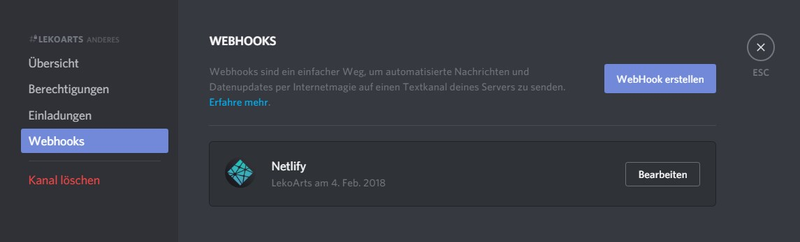
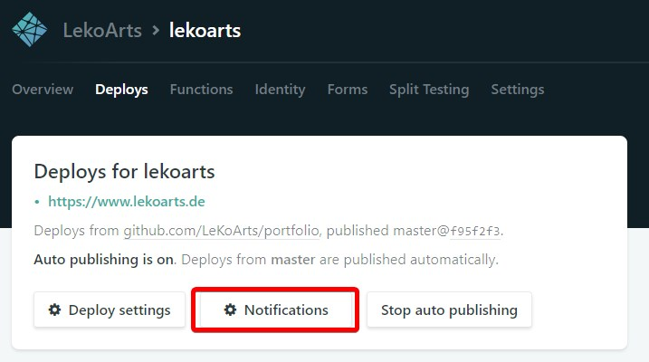
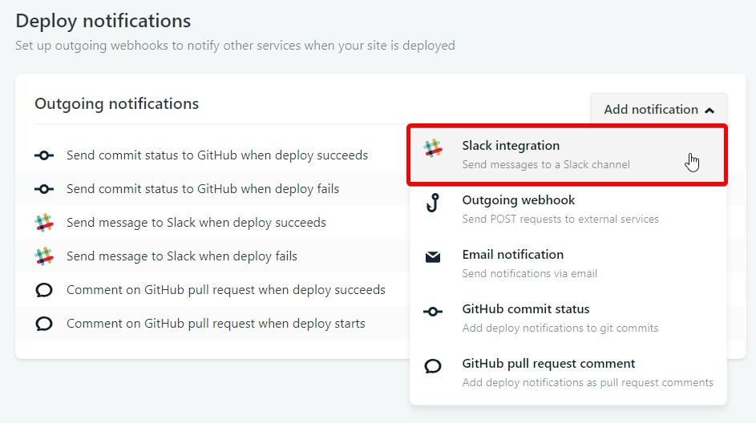

[Netlify](https://www.netlify.com/) unterstützt sowohl einkommende als auch ausgehende [Webhooks](https://www.netlify.com/docs/webhooks/) für die Kommunikation mit externen Diensten. Auch [Discord](https://support.discordapp.com/hc/de/articles/228383668-Webhooks-verwenden) erlaubt die Nutzung von Webhooks — es liegt also nahe, dass man sich Benachrichtigungen auch an Discord schicken lassen kann. Du kannst dir Nachrichten schicken lassen, wenn der Deploy erfolgreich/missglückt war, wenn Nachrichten beim Kontaktformular reingekommen sind oder wenn die Vorschau zu einem Pull Request erstellt wurde. Wer schon länger Slack genutzt hat, kennt das.

## Schritt 1

Suche dir einen Channel auf deinem Server aus (bzw. wenn du noch keinen eigenen Server hast, erstelle einen), in dem die Nachrichten reinkommen sollen. Gehe dann per `Rechtsklick auf Channel → Kanal bearbeiten → Webhooks` zum *Webhook erstellen* Dialog.

## Schritt 2

Gehe nun zu deinem Netlify Dashboard und klicke auf *Notifications*. Wähle im Dropdown *Add notification* den Unterpunkt *Slack Integration* aus.

## Schritt 3

Und hier kommt der **Trick**. Beim Einfügen deiner Webhook URL musst du ein `/slack` hinter die URL anfügen, damit am Ende alles reinbungslos funktioniert. Disord selber dokumentiert das in ihrer [Developer Documentation](https://discordapp.com/developers/docs/resources/webhook#execute-slackcompatible-webhook).

