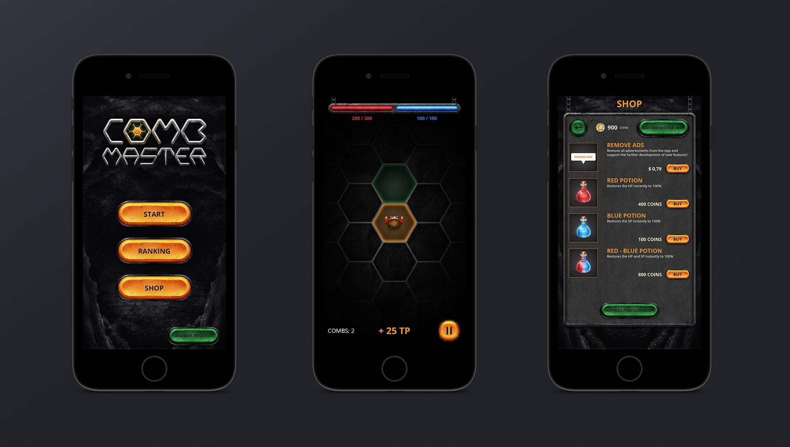
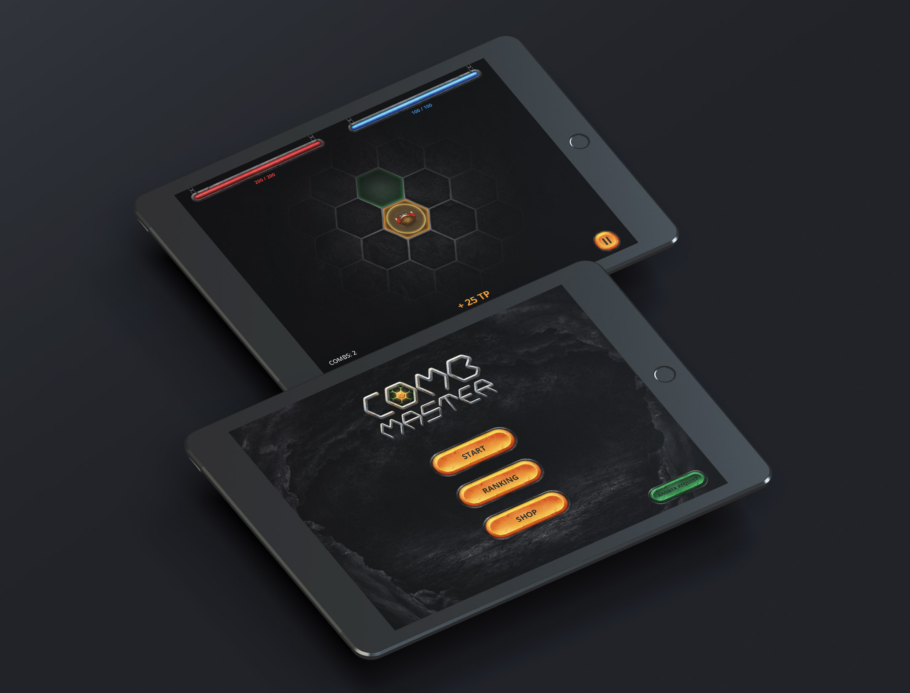

# Hintergrund

Mein Kunde brauchte für seine erste Spiele-App Beratung und ein passendes Design zur Idee. Die Grundidee ist es, so lange wie möglich durch die dunkle Höhle zu laufen und dabei zu überleben – denn auf dem Weg begegnen einen sowohl unterstützende Items (Leben und Mana) als auch böse Höhlenwächter (bzw. Zombies), die im Kampf sowohl Leben als Auch Mana wieder reduzieren. Das Spielfeld wird in Sechsecke aufgeteilt (die „Combs“). Gewünscht war ein rustikales, plastisches Design inklusive Logo. Die Universal-App sollte später auf iPhone und iPad erscheinen.

# Prozess

Um die Idee und das Setting der App in das Design zu übertragen, habe ich mir vor allem im App-Bereich Inspiration geholt, und dabei genau auf die Positionierung der Elemente und die Farbgebung geachtet. Dadurch habe ich wichtige Elemente im Bereich des Daumens positioniert und zusätzlich farblich hervorgehoben. Da man hierbei nicht mit vektorbasierten Grafiken arbeiten konnte, war besonders darauf zu achten alle Grafiken in 3-facher Größe zu erstellen, um auf dem iPhone und iPad das „Retina“-Display zu nutzen. Nachdem der Splash- und Startscreen fertig war (Eingang einer Höhle) und die Buttons erstellt waren, ging es an die Items und das Logo des Spiels. Auch die Items sollten eher in einem realistischen, statt abstraktem Stil erstellt werden – im Bereich des Fantasy MMORPG ließ sich viel Inspiration finden.

Sowohl das Logo als auch das App-Icon spiegeln das Wort „Comb“ (Wabe) wider, zusätzlich deutet das App-Icon an, dass man sich auf einem Hexagonalen Grid bewegen und Entscheidungen treffen muss.

# Resultat

Das Resultat stellte sowohl den Kunden als auch zahlreiche Tester und Nutzer zufrieden. Das Design setze von Anfang an die richtige Stimmung und fokussierte sich auf den Spielverlauf. Sowohl auf dem iPhone als auch iPad läuft das Spiel performant.

