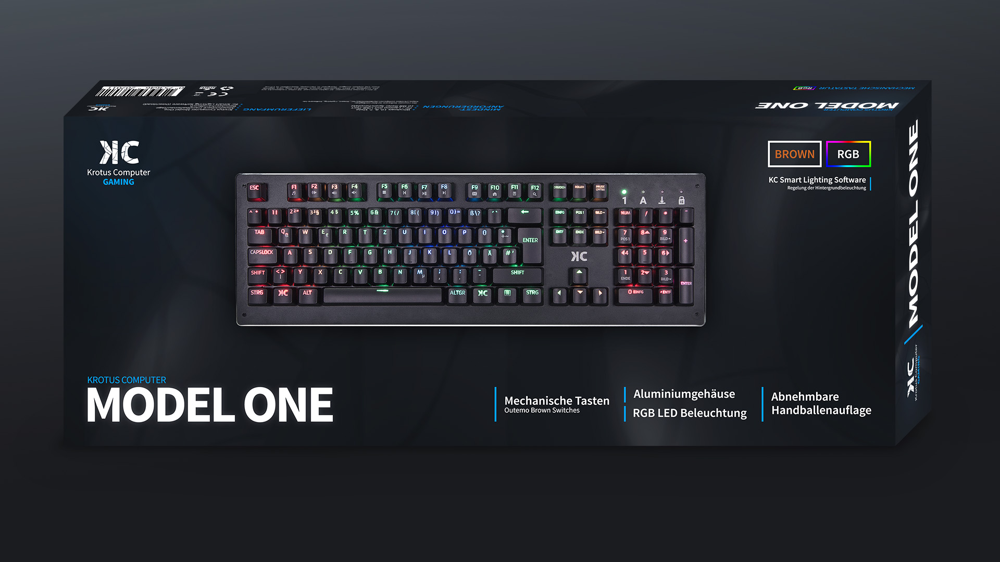

# Hintergrund

[Krotus Computer](https://krotus-computer.de/) bietet seit 2014 seinen Kunden professionelle Beratung und individuell zusammengestellte PCs. Der Kunde kann sich im gemeinsamen Gespräch einen Wunsch-PC zusammenstellen lassen — die persönliche Kundennähe ist eine große Stärke. Im letzten Jahr ergab sich dann die Gelegenheit für den jungen Gründer eine eigene Tastatur produzieren zu lassen. Natürlich bietet es sich an, neben den PCs auch Peripherie zu verkaufen.

Die herstellende Firma in China gab an, dass beim Tastenlayout, der Verpackung und der beiliegenden Software ein komplett eigenes Branding möglich sei — und genau das war dann auch meine Aufgabe: Das Branding der Tastatur, sprich die oben erwähnten Punkte, im Einklang mit der Marke Krotus Computer zu erstellen.

# Prozess

Insgesamt sollte die Tastatur und Verpackung modern wirken bzw. nicht wirklich nach außen hin "Gaming" schreien und das Branding die Qualität dieser Tastatur (trotz des geringen Preises) hervorheben. Auch sollte das vorhandene Logo erweitert werden, um die Peripherie-Sparte abzubilden.

Zuerst ging es an das Tastaturlayout, das später in die Keycaps per Laser übertragen werden sollte. Mit der Schriftart *Armata* habe ich eine schlichte Schrift in der richtigen Schriftstärke gefunden gehabt.

Für die Verpackung stand nur die Primärfarbe fest, nämlich ein Hellblau, das auch schon bei Krotus Computer als Farbe in Verwendung ist. Inspiriert durch die Verpackungen von Corsair kamen große Schriften und viel Whitespace zum Einsatz, um den Fokus auf den Namen, Features und die Bilder zu legen. Die ansonsten dunklen Blau-Grau Töne wurden gewählt, um Kontrast zu den Elementen darüber zu haben — und weil dunkle Töne/Schwarz als edel empfunden werden. Die professionellen Bilder der chinesischen Kollegen machen viel aus in diesem Design und ermöglichen es auch auf der Rückseite alle Vorzüge der Tastatur toll darzustellen. Um hervorzuheben, dass es sich um eine mechanische Tastatur handelt, illustrieren Icons am Rand und die auffälligen *RGB* Rahmen diesen Vorteil.

Mit dem fertigen Design der Verpackung stand die Basis des restlichen Brandings: Marketing Material wie Flyer, Banner etc. basieren auf der Vorlage, die klaren Design-Elemente erlaubten darüber hinaus eine Wiederverwendbarkeit. Aber auch die Tastatur-Software war noch zu erstellen! Da die Technikabteilung der chinesischen Firma klare Anforderungen hatten, war hierbei die Herausforderung in dem engen Rahmen der Software das eigene Branding aufzustülpen.

**Zeitsprung:** Nach der Produktion der Tastatur stand noch ein Update des Online-Shops an. Die prominente Nutzung von Schrift in Verbindung mit Bildern sollte übertragen werden, sodass die komplette Startseite umgestaltet wurde und jede Kategorie ein neues Vorschaubild erhalten hat.

# Resultat

Mit der *MODEL ONE* konnte das erste Produkt in der *Gaming* Sparte von Krotus Computer erfolgreich auf den Markt gehen. Das Produkt bietet über mehrere Medien hinweg ein stimmiges, professionelles Gesamtbild und stellt heraus, dass trotz des günstigen Preises Qualität zu erwarten ist. Das Branding der *Gaming* Sparte ist auch für mögliche zukünftige Produkte geeignet, sodass am Ende eine Produktreihe mit einheitlichem Design steht.

