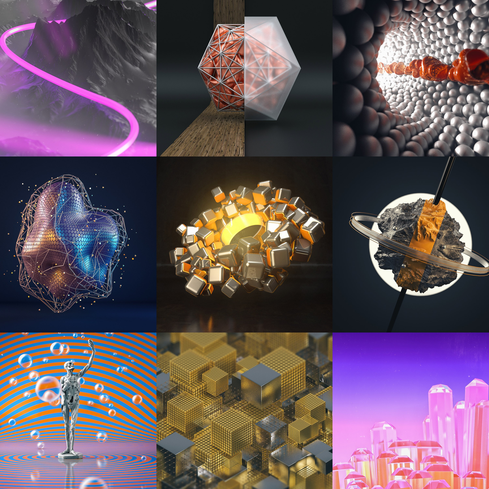

# Hintergrund

> **Proprius (Latein):** beständig, dauernd, unvergänglich, bleibend

Als sicherlich nicht erste, aber auch nicht letzte Person auf Instagram und allgemein in der medienschaffenden Welt hatte ich mich einer sog. „Daily Challenge“ für das Jahr 2016 gestellt. Ziel solcher Challenges ist es, ein Jahr lang jeden Tag ein Bild zu erstellen und dieses zu veröffentlichen. Hierbei lernt man die genutzten Programme besser kennen (bzw. findet in manchen Fällen einen Einstieg in diese), verfeinert insbesondere im Hinblick auf Geschwindigkeit seinen Workflow und arbeitet somit effizienter. Ich nutzte diese Gelegenheit, um mit Cinema4D und dem allgemeinen 3D-Kosmos vertrauter zu werden – andere Künstler zeichnen oder komponieren jeden Tag.

Als Name habe ich das sehr treffende lateinische Adjektiv **proprius** gewählt, da ich alle Wortbedeutungen mit dem Projekt assoziieren konnte.

# Prozess

Da ich jeden Tag auf Instagram unterwegs war, war es natürlich naheliegend bei anderen Designern Inspiration zu suchen, speziell bei denen, die selber solch eine Challenge momentan durchführen. Die fertigen Bilder sollten nicht immer einen Sinn haben, sondern dienten dazu spezielle Techniken zu erlernen, Materialien oder Programme auszuprobieren. Dennoch steckt in einigen Bildern eine Nachricht, da ich zum Beispiel auf das aktuelle Tagesgeschehen reagiert habe.

Nachdem die Idee im Kopf entstanden ist, habe ich Cinema4D geöffnet und auf die Uhr geschaut – da ich nicht länger als 1-2h für das Bild aufbringen wollte (das Rendern zählte nicht dazu). Wichtig war es, nicht zu perfektionistisch zu werden, sondern Fehler bzw. „schlechtes Aussehen“ zu akzeptieren und daraus zu lernen. Es brauchte viele Iterationen bis ich mit dem finalen Bild zufrieden war. Anfangs habe ich die Bilder mit dem integrierten Physik-Render ausgegeben, später mit Arnold Renderer. In Photoshop habe ich das Bild anschließend mit einem Filter von VSCO belegt und nachgeschärft. Auch habe ich bei der *36 Days of Type* Challenge mitgemacht, mit teilweise sehr witzigen Bildern! Hier mal ein Speedart zum Bild #155:

<iframe width="1280" height="720" src="https://www.youtube.com/embed/ax6ALNcb868" frameborder="0" allowfullscreen></iframe>

# Resultat

Rückblickend konnte ich aus der Challenge viel mitnehmen:
- Ich habe über Cinema4D und Konsorten viel gelernt; auch gelernt wie man effektiv und schnell arbeitet
- Nicht jedes Bild muss perfekt sein, irgendwann sollte man es ruhen lassen
- Es gefallen mir nicht alle Bilder. Es sind auch Bilder dabei, die ich heute so wohl nicht mehr erstellen würde - aber das ist der Lerneffekt und das Ergebnis von Ausprobieren

Alle Bilder in voller Auflösung sind auf meinem [Behance-Profil](https://www.behance.net/lekoarts) zu finden. Meine persönlichen Favoriten sind diese Bilder:

