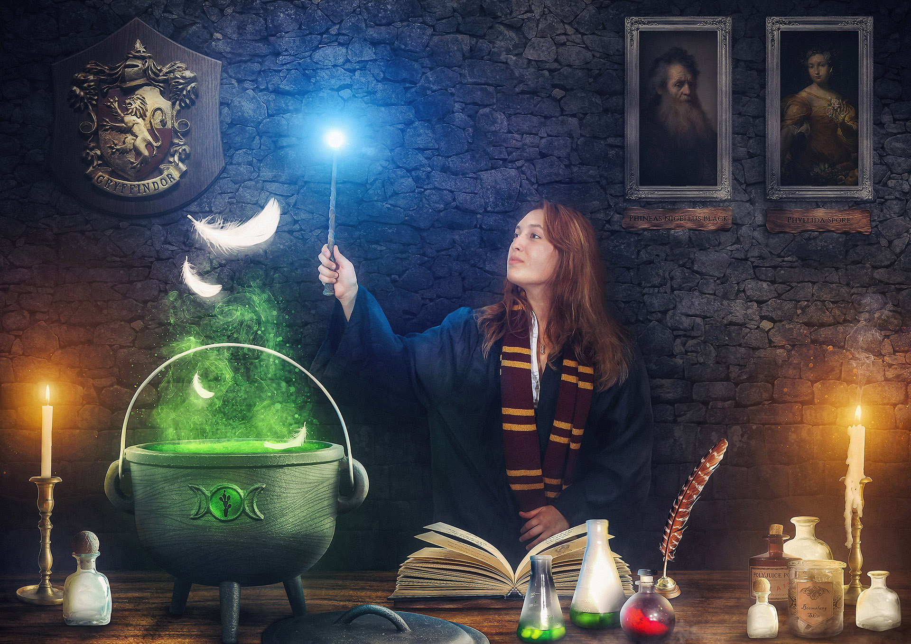
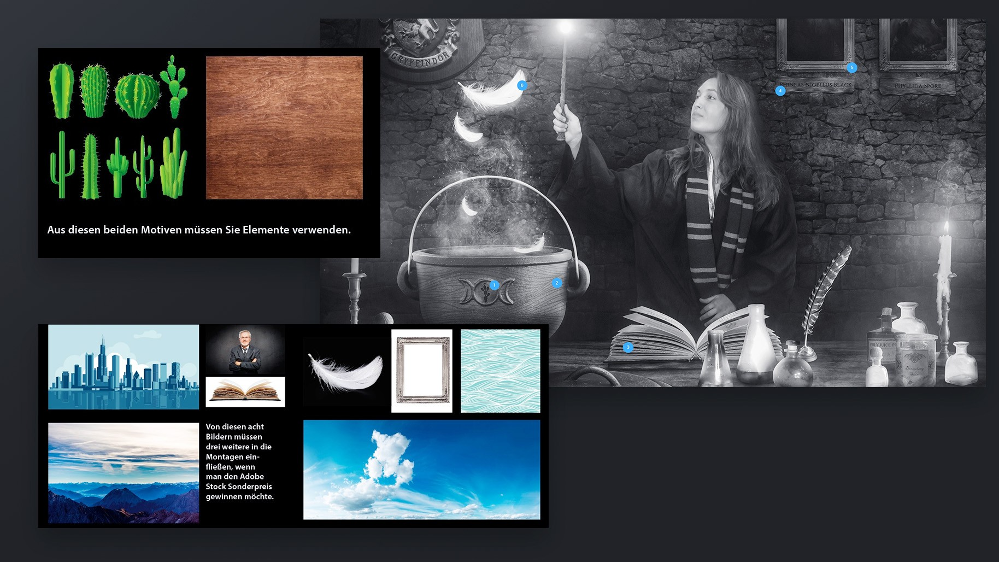

# Hintergrund

> Das unabhängige DOCMA-Magazin (gegründet 2002) erscheint alle zwei Monate bei der DOCMAtischen Gesellschaft und richtet sich an Fotografen, Bildbearbeiter sowie andere Medienschaffende, die wissen wollen, was mit Hilfe von Bildbearbeitungsprogrammen wie Photoshop technisch machbar ist und vor allem wie es geht. Bei DOCMA werden deshalb zahlreiche Photoshop Tutorials veröffentlicht, um die Arbeit mit Photoshop und anderen Bildbearbeitungsprogrammen zu erleichtern. [Quelle](https://www.docma.info/ueber-docma)

Mit dem DOCMA Award findet jährlich ein in Deutschland angesehener Wettbewerb statt, der mit spannenden Themen aufwartet und sich stets an Bildbearbeiter jeden Wissensstandes richtet. Im Jahr 2017 gab es allerdings eine Neuerung – den Adobe Stock Sonderpreis. Neben der Aufgabe eine Kurzgeschichte (SSST: Super Short Story Telling) zu erzählen, galt es außerdem aus 10 vorgegebenen Bildern mindestens 5 für das eigene Bild zu verwenden. Die Bilder wurden von Adobe Stock bereitgestellt. Die Kurzgeschichte selber durfte nicht länger als 300 Zeichen sein.

# Prozess

Als großer Harry Potter Fan hatte ich schon lange vor ein Composing zu diesem Universum zu erstellen, nur fehlte bislang die Gelegenheit. Beim Anblick der vorgegebenen Stock-Bilder kam mir aber sofort eine Idee, die wie immer in meinem Notizbuch als Skizze landete.

Durch das Buch und die Feder kam ich recht schnell auf die Idee einen Zauberer beim Herstellen eines Tranks zu zeigen. Um zu verdeutlichen, dass es sich um das Harry Potter Universum handelt sollten Requisiten wie Wappen und Bilder an die Wand.

Für ein gelungenes Composing müssen mehrere Faktoren stimmen – zwei davon sind die Komposition und realitätsnahe Perspektive/Proportionen. Um sich vorab Gedanken über die Bildaufteilung machen zu können, ist eine 3D-Software die optimale Wahl, um schnell einen Prototypen zu erstellen. Außerdem kann man dort sicherstellen, dass die Größenverhältnisse der einzelnen Elemente stimmen und die perspektivische Verzerrung betrachten. Mein Prototyp sah wie folgt aus:

Nach Sichtung der benötigten Bilder in meinem Archiv und im Internet, machte ich mich an die Arbeit. Dabei war immer wieder die Vorlage aus der 3D-Software sehr hilfreich, um den einzelnen Bildern die richtige Größe zu verpassen. Der Prozess sah in etwas so aus:

# Resultat

Abweichend von der Skizze habe ich kein Teleskop im Hintergrund positioniert, da ich den Fokus auf den Kessel und dessen Trank lenken wollte. Das Arbeiten mit dem vorgegebenen Stock-Material war angenehm, da es sich gut in meine Szene einbinden ließ. Das Bild zeigt wie gewünscht einen starken Bezug zu Harry Potter, der sich auch in meiner Super Short Story widerspiegelt:

> Irgendetwas verbarg Professor Snape - das fühlte Hermine. Sie hat viel über Veritaserum, ein Wahrheitselexier, gelesen und schlich sich in den Keller, um heimlich den Zaubertrank herzustellen. Zum Glück konnte Hagrid ihr Jobberknoll-Federn geben. Bald wüsste sie von seinem dunklen Geheimnis...

