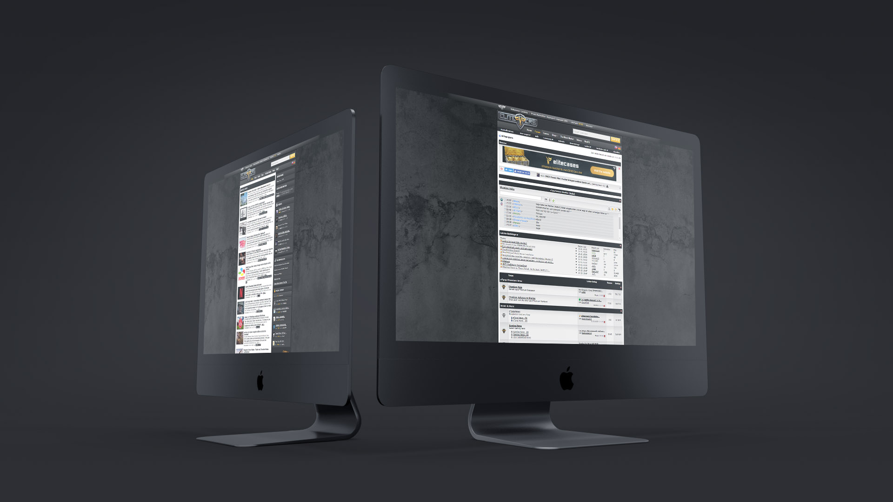
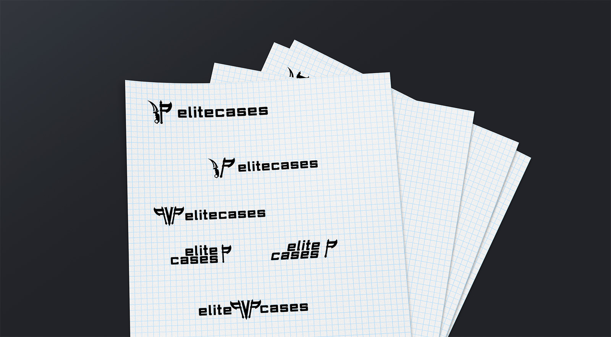
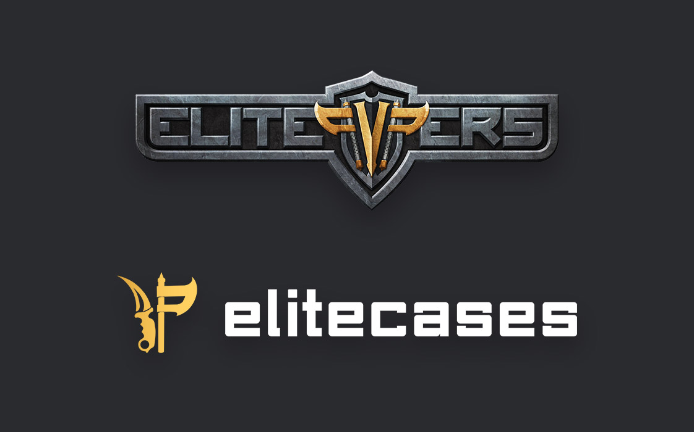

# Hintergrund

[elitepvpers](https://www.elitepvpers.com), das größte deutsche Gaming-Forum, bietet neben vielen Foren zum Diskutieren auch einen Marktplatz, um virtuelle Spiele-Gegenstände zu (ver)kaufen. Die User handeln untereinander über die Plattform, die elitepvpers bietet. Als weiteres Zusatzangebot für die User sollte eine sog. „Case-Opening“ Website erstellt werden, die es ermöglicht Items verschiedenster Spiele durch das Öffnen von Kisten zu erlangen. Das hierfür wohl beliebteste Spiel ist Counter Strike: Global Offensive. Als Partnerseite sollte elitecases (auch der Name wurde in Anlehnung an elitepvpers gewählt) dem Design ähneln, allerdings auf Flat 2.0 setzen – da bislang das Design von elitepvpers noch von 2009 und somit nicht mehr zeitgemäß ist.

elitecases sollte einen schnellen, intuitiven und angenehmen Einstieg bieten und einen störungs- und ablenkungsfreien Aufenthalt garantieren. Außerdem sollte das Design so neutral wie möglich gehalten werden, sodass ein breites Angebot an Spielen in der Zukunft geboten werden kann.

# Prozess

Bei diesem Projekt standen zuerst das Logo und die Farbwahl im Fokus. Das Logo sollte an elitepvpers erinnern, aber eigenständig genug sein – und dabei gleichzeitig so neutral sein, dass man sich nicht auf ein spezielles Spiel festlegt. Im Laufe der Iterationen ist dann die Wahl auf eine Kombination aus „Karambit“ Messer (aus CS:GO) und der ikonischen elitepvpers Axt geworden.

elitepvpers trägt als Primärfarben Gold und Grautöne, analog dazu besitzt elitecases Goldverläufe und (bläuliche) Grautöne inklusive blauer Sekundärfarbe.

Nachdem das Logo und Farbschema final waren, wurden zuerst Low-Fidelity, dann High-Fidelity Prototypen erstellt, letztere mit Hilfe von InVision. In InVision kann man schnell statische Bilder zu Prototypen verwandeln, diese teilen und direktes Feedback erhalten. Prototypen sind ein wichtiges Werkzeug im Designprozess, um schon früh ein Gefühl für das Design und die User Experience zu bekommen. Der finale Prototyp ging durch mehrere Revisionen, bot am Ende aber ein solides Fundament, um mit der Front-End Arbeit zu beginnen.

Aufgrund des großen Funktionsumfanges, der guten Anpassbarkeit und Dokumentation wurde Bootstrap v4 (Beta) als Front-End Framework gewählt, Django für das Back-End.

# Resultat

elitecases löst die gestellten Probleme durch ein modernes Flat 2.0 Design, zurückhaltenden Hintergrundfarben und einer sofortigen Möglichkeit auf der Startseite die Plattform auszuprobieren. Bei den Items und Buttons wurde mit knalligen Farben und Verläufen gearbeitet, um dem ansonsten minimalistischen Design ein bisschen „Pepp“ zu verleihen. Um die Kisten (die passend zu den Item-Farben zusammengestellt werden) einheitlicher darzustellen, sind Überschriften, Tooltips und Buttons jeweils in der gleichen Farben wie die Kiste eingefärbt - so bilden sie zusammen eine Einheit. Dank Bootstrap wird die Website auf allen Endgeräten passend dargestellt, ohne dabei Funktionsumfang einzubüßen.

